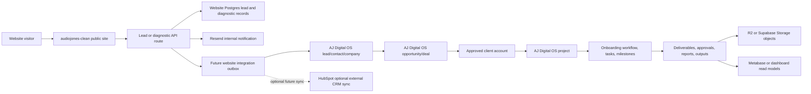

# Client Lifecycle Schema

**Status:** architecture bridge specification
**Date:** 2026-07-03
**Owner:** AudioJones engineering
**Scope:** `audiojones-clean` public website lead lifecycle, CRM/operational handoff into AJ-DIGITAL-OS-V1, deliverable/report storage boundaries
**Decision level:** schema planning only. No code, migration, route, UI, CRM, n8n, or storage implementation is authorized by this document.

## Decision Summary

`audiojones-clean` must not become a second CRM, project manager, onboarding system, or deliverable system.

Canonical split:

| System | Canonical ownership |
| --- | --- |
| `audiojones-clean` | Public website, content, diagnostics, lead capture, conversion events, marketing attribution, diagnostic report snapshots, handoff events |
| FIVR / methodology layer | Scoring methodology, diagnostic semantics, offer-routing contracts |
| AJ-DIGITAL-OS-V1 | Canonical CRM and operational truth: contacts, companies, leads, deals/opportunities, clients, projects, onboarding, workflows, tasks, milestones, deliverables, approvals, internal reporting, memory, audit, attribution |
| HubSpot | Optional future external CRM sync target only. HubSpot is not canonical CRM truth |
| n8n | Orchestration only. It does not own customer, project, lead, result, or delivery truth |
| R2 / Supabase Storage | File/object storage only. Databases store object references and metadata, not binary deliverable truth |
| Metabase / dashboards | Reporting and read-only analytics. They do not own lifecycle state |
| PostHog | Behavioral analytics only. It does not own lifecycle state |
| Sanity | Marketing/content CMS only |

Hard rule:

AJ Digital OS is the canonical CRM and operational control plane for this lifecycle. If AJ Digital OS owns, or is intended to own, CRM/client/project/onboarding/deliverable concepts, `audiojones-clean` must define handoff events and contracts instead of creating duplicate canonical tables for those concepts.

Public-repo caution:

`AJ-DIGITAL-OS-V1` is public at `https://github.com/AudioJones-Dev/AJ-DIGITAL-OS-V1.git`. No secrets, client data, credentials, private CRM exports, production database dumps, sensitive operational logs, or non-public deliverables should ever be committed there.

## Inspection Evidence

### `audiojones-clean`

Inspected:

- `docs/architecture/backend-stack.md`
- `docs/architecture/stack-decision.md`
- `src/app/api/founder-intelligence/leads/route.ts`
- `src/db/leads.ts`
- `src/lib/leads/lead-notifications.ts`
- `db/migrations/001_applied_intelligence_leads.sql`
- `db/migrations/002_founder_gravity_audit_leads.sql`
- targeted searches across `src/` and `docs/` for portal, client, project, deliverable, Firebase, CRM, n8n, and webhook references

Findings:

- `audiojones-clean` is canonically a public content, authority, diagnostic, lead capture, and conversion site.
- Firebase is explicitly excluded for new work.
- Current Founder Intelligence lead capture validates with Zod, scores the lead, persists to Neon, sends Resend notification, and optionally posts to n8n.
- n8n is optional and non-blocking. Lead durability is in Neon before webhook dispatch.
- Existing tables are marketing/diagnostic intake tables, not operational CRM/project tables.
- Legacy portal/client/admin routes still reference Firebase-era surfaces and must not become the source of truth for new lifecycle design.

### `C:\dev\AJ-DIGITAL-OS` / `AJ-DIGITAL-OS-V1`

Inspected:

- `AGENTS.md`
- `docs/AGENTS.md`
- `README.md`
- `package.json`
- `docs/system/AJ_DIGITAL_OS_MASTER_ARCHITECTURE_SCHEMA.md`
- `docs/specs/AJ_DIGITAL_MULTI_TENANT_CRM_MODULE_SPEC.md`
- `docs/specs/AJ_DIGITAL_MULTI_TENANT_CRM_DB_RLS_SPEC.md`
- `docs/integration/PORTAL_OS_INTEGRATION_CONTRACT.md`
- `docs/architecture/deliverable-and-approval-routing-spec.md`
- `docs/architecture/deliverable-approval-lifecycle-spec.md`
- `docs/architecture/task-category-and-folder-spec.md`
- `docs/onboarding.md`
- `src/crm/AGENTS.md`
- `src/crm/crm-types.ts`
- `src/crm/crm-store.ts`
- `src/crm/crm-service.ts`
- `src/crm/crm-schemas.ts`
- `src/crm/persistent-crm-store.ts`
- `src/crm/postgres-crm-store.ts`
- `supabase/migrations/20260626150000_crm_multitenant_rls.sql`
- `sql/supabase-schema.sql`
- `sql/neon-os-schema.sql`
- `src/types/deliverable.types.ts`
- `src/core/deliverable-store.ts`
- `src/services/runtime/deliverable-lifecycle.ts`
- `src/storage/r2-client.ts`
- `ui/dashboard/src/components/ClientsView.tsx`
- `ui/dashboard/src/components/OnboardingView.tsx`
- `ui/dashboard/src/components/DeliverablesView.tsx`
- `ui/dashboard/src/components/ClientDeliverables.tsx`
- `ui/dashboard/src/lib/types.ts`
- `ui/dashboard/src/lib/queries.ts`

Repo reference:

- Local checkout: `C:\dev\AJ-DIGITAL-OS`
- Public remote: `https://github.com/AudioJones-Dev/AJ-DIGITAL-OS-V1.git`

Findings:

- AJ Digital OS is explicitly defined as the operating-system and governance repo for workflow orchestration, diagnostics, approvals, attribution, dashboard, local-first execution, CRM, and delivery surfaces.
- AJ Digital OS includes a tenant-native CRM domain with `CrmTenant`, `CrmContact`, `CrmCompany`, `CrmLead`, `CrmOpportunity`, `CrmPipeline`, `CrmTask`, `CrmConversation`, commercial document, and tenant memory types.
- AJ Digital OS includes `CrmService`, permission and approval gates, audit emission, attribution emission, a file-backed CRM store, and a Postgres CRM store.
- AJ Digital OS has an executable Supabase/Postgres CRM migration for tenant-scoped CRM tables with RLS.
- AJ Digital OS has client, mission, run, deliverable, asset, subscription, and client-agent schema surfaces in `sql/supabase-schema.sql`.
- AJ Digital OS has deliverable lifecycle records, local output routing, approval transitions, and R2 client support.
- AJ Digital OS already has a draft Portal to OS integration contract based on events and projections, not shared databases.
- Because the remote is public, architecture docs may describe contracts and schema, but secrets, credentials, client data, private exports, and sensitive deliverables must remain out of the repo.

## Current Truth

### Website Lead Capture

Current lead flow:

1. Visitor submits a public website form or diagnostic form.
2. `src/app/api/founder-intelligence/leads/route.ts` validates input with `appliedIntelligenceLeadSchema`.
3. `scoreFounderIntelligenceLead(...)` calculates lead scores.
4. `persistFounderIntelligenceLead(...)` writes to Neon via `src/db/leads.ts`.
5. `notifyFounderIntelligenceLead(...)` sends an internal email and optionally fires `N8N_LEAD_WEBHOOK_URL` or `CRM_WEBHOOK_URL`.
6. The API response returns `leadId`, `priority`, and `totalScore`.

Current durable website tables:

| Table | Current role | Canonical future interpretation |
| --- | --- | --- |
| `applied_intelligence_leads` | Founder Intelligence / Applied Intelligence lead submission, score, status, and marketing attribution | Marketing lead submission plus score snapshot. Not canonical CRM truth |
| `founder_gravity_audit_leads` | Founder Gravity submitted report, answers, result JSON, CTA/routing metadata, and attribution | Diagnostic session/result/report snapshot. Not canonical CRM/project truth |

### Website Legacy Surfaces

Search found legacy portal/client/admin routes using Firebase-era helpers or stubs. These include `/api/portal/*`, `/api/client/*`, and related governance/admin surfaces.

These are not canonical for this schema. New lifecycle work must not reinforce those Firebase-era routes.

### AJ Digital OS Operational Layer

AJ-DIGITAL-OS-V1 currently contains:

- Tenant-scoped CRM contracts and stores.
- Postgres/RLS CRM schema.
- Clients, missions, runs, deliverables, assets, subscriptions, and client-agent schema surfaces.
- Deliverable registry and lifecycle transitions.
- Approval and audit concepts.
- Attribution event concepts.
- R2 storage adapter.
- Dashboard/client/onboarding/deliverable UI shells.
- Event/projection doctrine for portal integration.

Therefore, AJ-DIGITAL-OS-V1 is the canonical CRM and operational control plane for this lifecycle.

## Lifecycle Flow



Canonical flow:

1. `audiojones-clean` captures the lead or diagnostic submission.
2. `audiojones-clean` stores the submission, score snapshot, consent, source, UTM, route, and diagnostic result.
3. `audiojones-clean` emits a handoff event after durable write.
4. AJ Digital OS receives the handoff and creates or links the canonical lead/contact/company records.
5. AJ Digital OS creates or links the opportunity/deal.
6. An approved client account moves into AJ Digital OS project/onboarding workflow.
7. AJ Digital OS owns tasks, milestones, deliverables, approvals, reports, outputs, operational attribution, and tenant-scoped memory.
8. Storage systems store files only; databases store object references and metadata.
9. HubSpot may receive an optional future sync projection, but it is not canonical truth.

## Ownership Model

| Lifecycle object | Canonical owner | `audiojones-clean` responsibility |
| --- | --- | --- |
| Public pages | `audiojones-clean` / Sanity | Render, convert, and attribute |
| Lead submission | `audiojones-clean` Postgres | Capture durable marketing submission |
| Diagnostic session/result | `audiojones-clean` Postgres | Capture diagnostic answers, scores, route, report snapshot |
| Marketing attribution | `audiojones-clean`, PostHog when approved | Capture UTM/source/session/funnel events |
| Contact/company/deal relationship | AJ Digital OS CRM module | Emit handoff request only |
| Tenant/client workspace | AJ Digital OS | Emit handoff request only |
| Operational CRM lead/contact/opportunity | AJ Digital OS CRM module | Do not duplicate as website-owned tables |
| Optional external CRM projection | HubSpot, if approved later | Emit sync events only after AJ Digital OS ownership is preserved |
| Onboarding workflow | AJ Digital OS | Emit accepted-client handoff only |
| Project/workflow execution | AJ Digital OS | No website-owned project tables |
| Deliverables/reports | AJ Digital OS | Link to public offer/report only when needed |
| Files/assets | R2 or Supabase Storage | Store URLs/keys only if website needs a display snapshot |
| Orchestration | n8n | Send events only. n8n stores no lifecycle truth |
| Analytics/reporting | PostHog/Metabase/read models | Emit/read events only |

## Canonical Website-Owned Schema Concepts

This section defines logical ownership, not migrations.

`audiojones-clean` may own these future normalized concepts:

| Logical model | Purpose |
| --- | --- |
| `website_lead_submissions` | Public form submissions, raw validated input snapshot, consent, source route, UTM, IP hash, user agent |
| `diagnostic_sessions` | Diagnostic runtime session, diagnostic key, version, entry route, started/completed timestamps |
| `diagnostic_answers` | Normalized question answers when diagnostics move beyond JSON snapshots |
| `diagnostic_results` | Score snapshot, result version, routing recommendation, normalized score polarity |
| `diagnostic_report_snapshots` | Website-displayable report state at completion time |
| `website_conversion_events` | Funnel events such as page viewed, diagnostic started, completed, lead captured, booking clicked |
| `integration_outbox_events` | Durable post-commit events for AJ Digital OS, n8n, PostHog, Metabase loaders, optional future HubSpot sync, or other subscribers |
| `integration_delivery_receipts` | Handoff status, retry state, idempotency, and downstream object references |

`audiojones-clean` should not own these as canonical tables:

- `clients`
- `projects`
- `onboarding_profiles`
- `milestones`
- `deliverables`
- `assets`
- `approvals`
- `crm_contacts`
- `crm_companies`
- `crm_leads`
- `crm_opportunities`
- `crm_tasks`
- `crm_audit_events`
- `crm_attribution_events`

Those already exist, or are explicitly planned, in AJ Digital OS and its CRM/operational schema.

## Existing Table Mapping

| Existing asset | Current status | Future mapping |
| --- | --- | --- |
| `applied_intelligence_leads` | Active website Neon table | Keep as current lead table until normalized website lead/diagnostic schema exists. Treat as marketing submission and score snapshot |
| `founder_gravity_audit_leads` | Active diagnostic report capture table | Keep as current Founder Gravity diagnostic submission/result table. Treat as diagnostic session/result/report snapshot |
| `src/app/api/founder-intelligence/leads/route.ts` | Active lead API | Remains website intake route. Future work can emit outbox events after persistence |
| `src/lib/leads/lead-notifications.ts` | Active email/n8n notification path | Keep non-blocking. Future outbox should replace direct operational handoff logic |
| Firebase-era `/api/portal/*` and `/api/client/*` | Legacy/non-canonical for new lifecycle | Do not extend for new lifecycle ownership |
| AJ Digital OS `crm_*` migration | Operational CRM schema baseline | Downstream operational owner for tenant-scoped CRM objects |
| AJ Digital OS `clients`, `missions`, `mission_runs`, `deliverables`, `assets` | Operational/control schema surfaces | Downstream owner for client work, runs, deliverable metadata, and storage references |

## AJ Digital OS Alignment

### 1. What currently exists in `C:\dev\AJ-DIGITAL-OS`?

AJ Digital OS currently contains:

- A local-first TypeScript CLI/operator system.
- Approval-gated run lifecycle and workflow execution surfaces.
- Tenant-native CRM types, schemas, service, file-backed store, Postgres store, audit, attribution, and approval policy.
- An executable CRM Supabase/Postgres RLS migration.
- Supabase control schema for clients, missions, mission runs, deliverables, assets, subscriptions, and client agents.
- Deliverable lifecycle service and registry.
- R2 client for artifact storage.
- Dashboard UI components for clients, onboarding, deliverables, and client deliverables.
- Draft Portal to OS integration contract based on events and projections.
- Architecture docs naming AJ Digital OS as the operating system for workflow orchestration, diagnostics, approvals, attribution, dashboard, CRM, and local-first execution.
- Public remote: `https://github.com/AudioJones-Dev/AJ-DIGITAL-OS-V1.git`.
- Public-repo caution: no secrets, client data, credentials, private CRM exports, production database dumps, sensitive operational logs, or non-public deliverables belong in this repository.

### 2. Does AJ Digital OS already define client/project/deliverable lifecycle objects?

Yes for clients, CRM objects, workflows, deliverables, assets, approvals, audit, attribution, and storage references.

Evidence:

- `supabase/migrations/20260626150000_crm_multitenant_rls.sql` defines `crm_tenants`, `crm_contacts`, `crm_companies`, `crm_leads`, `crm_opportunities`, `crm_pipelines`, `crm_tasks`, `crm_notes`, `crm_activities`, connector metadata, knowledge, memory, attribution, audit, and approval refs.
- `sql/supabase-schema.sql` defines `clients`, `missions`, `mission_runs`, `deliverables`, `assets`, `subscriptions`, and client-agent surfaces.
- `src/types/deliverable.types.ts`, `src/core/deliverable-store.ts`, and `src/services/runtime/deliverable-lifecycle.ts` define deliverable records and lifecycle transitions.
- `docs/integration/PORTAL_OS_INTEGRATION_CONTRACT.md` defines event/projection integration for portal projects, milestones, approval requests, deliverables, reports, support requests, activity logs, attribution projections, diagnostics, offers, and reports.

Nuance:

AJ Digital OS does not yet appear to have a final, fully production-accepted single `projects` table as the universal owner. The inspected contract places some portal presentation objects such as `projects` and `milestones` in a portal-owned surface, with OS receiving events. That still supports the same conclusion: `audiojones-clean` should not create project/onboarding/deliverable truth. It should hand off to the operational layer by contract.

### 3. Should `audiojones-clean` create its own client/project tables, or should it hand off to AJ Digital OS?

It should hand off to AJ Digital OS.

`audiojones-clean` may keep website-owned lead and diagnostic records. It should not create canonical client, project, onboarding, deliverable, approval, task, or operational CRM tables.

Reason:

- AJ Digital OS already has the tenant isolation doctrine, CRM domain, approval gates, deliverable lifecycle, storage references, and operating-system surface.
- Creating client/project tables in `audiojones-clean` would create a second operational system inside the marketing site.
- That would repeat the same architectural failure mode as diagnostic sprawl: multiple schemas, routing logic, analytics semantics, and maintenance burdens.

### 4. What should remain in `audiojones-clean`?

`audiojones-clean` should retain:

- Website content and conversion routes.
- Lead capture forms and diagnostic entry points.
- Validated lead submission records.
- Diagnostic sessions, answers, results, routing recommendations, and report snapshots.
- Consent snapshot and suppression state at capture time.
- UTM/source/referrer/user-agent/IP-hash attribution.
- Public booking CTA events.
- Durable integration outbox events and delivery receipts.
- Non-blocking notification hooks.

### 5. What should belong to AJ Digital OS?

AJ Digital OS should own:

- Tenant/client workspace provisioning.
- Operational CRM records.
- Contacts, companies, leads, opportunities/deals, lifecycle status, and follow-up ownership.
- Workflow execution and mission/run state.
- Onboarding workflow state.
- Project/workflow/task/milestone execution state.
- Deliverable lifecycle and approval state.
- Report generation and report-ready events.
- Client/business memory.
- Tenant-scoped audit and attribution events.
- Connector credential metadata and vault references.
- Operational dashboards and reporting projections.

### 6. What integration contract is needed between `audiojones-clean` and AJ Digital OS?

Required contract:

- Event-based handoff, not shared database access.
- HMAC-signed server-to-server events.
- Idempotency key per event.
- Stable schema version per event.
- `sourceSystem = "audiojones-clean"`.
- Public website lead ID and diagnostic session/result IDs as source references.
- Downstream object references returned as receipts, not copied ownership.
- Retryable outbox semantics.
- No raw secrets in payloads.
- No PII in URLs.
- No private CRM export files or client data committed to `AJ-DIGITAL-OS-V1`.

Minimum event families:

| Event | Direction | Purpose |
| --- | --- | --- |
| `website.lead_captured` | Website -> subscribers | Durable marketing lead was stored |
| `website.diagnostic_completed` | Website -> subscribers | Diagnostic result/report snapshot is complete |
| `website.booking_clicked` | Website -> subscribers | User entered booking intent |
| `website.handoff_requested` | Website -> AJ Digital OS | Lead is ready for operational intake |
| `ajos.handoff_accepted` | AJ Digital OS -> website/read model | OS accepted handoff and created/linked downstream refs |
| `ajos.handoff_rejected` | AJ Digital OS -> website/read model | OS rejected handoff with safe reason code |
| `ajos.report_ready` | AJ Digital OS -> website/portal/read model | Deliverable or report is ready for display or projection |

Minimum `website.handoff_requested` payload:

```json
{
  "eventId": "uuid",
  "eventType": "website.handoff_requested",
  "schemaVersion": 1,
  "occurredAt": "2026-07-03T00:00:00.000Z",
  "sourceSystem": "audiojones-clean",
  "lead": {
    "sourceLeadId": "uuid",
    "email": "founder@example.com",
    "name": "Founder Name",
    "companyName": "Example Co",
    "phone": "+1...",
    "consentToContact": true
  },
  "diagnostic": {
    "diagnosticKey": "founder-intelligence",
    "sessionId": "session-id",
    "resultId": "result-id",
    "scoreSummary": {
      "totalScore": 82,
      "priority": "urgent"
    }
  },
  "routing": {
    "recommendedOffer": "Founder Intelligence Systems Engagement",
    "handoffReason": "qualified_lead"
  },
  "attribution": {
    "sourcePage": "/founder-intelligence",
    "utmSource": null,
    "utmMedium": null,
    "utmCampaign": null
  }
}
```

### 7. What duplication risks exist?

Main duplication risks:

- Website CRM tables competing with AJ Digital OS CRM tables.
- Website project tables competing with AJ Digital OS missions/workflows or portal project objects.
- Website deliverable tables competing with AJ Digital OS deliverable registry and R2/storage references.
- n8n becoming a pseudo-CRM by holding long-lived business state in workflow data.
- HubSpot being treated as canonical instead of an optional sync target.
- PostHog/Metabase reports mixing marketing events and operational events without source ownership.
- Legacy Firebase-era portal routes becoming a hidden second client platform.
- Multiple lead IDs without cross-system idempotency and source reference mapping.

### 8. What migration or consolidation path is recommended?

Recommended path:

1. Keep current `applied_intelligence_leads` and `founder_gravity_audit_leads` unchanged until the diagnostic shared schema is approved.
2. Define website outbox and event contracts before adding CRM/project tables.
3. Add AJ Digital OS handoff only after `tenantId`, downstream target environment, and security contract are approved.
4. Add optional HubSpot sync only after AJ Digital OS remains canonical and the website lead/diagnostic event taxonomy is stable.
5. Treat existing Firebase-era portal/client routes as legacy surfaces to retire or redirect, not as migration targets.
6. Map website leads into AJ Digital OS through `website.handoff_requested` and downstream receipts.
7. If a separate client portal remains active, use the existing Portal to OS event/projection doctrine instead of shared tables.
8. Build reporting from read models and projections after source ownership is locked.

## Integration Events

Website events should be append-only and retryable.

| Event | Producer | Consumers | Required IDs |
| --- | --- | --- | --- |
| `website.lead_captured` | `audiojones-clean` | AJ Digital OS when qualified, PostHog, n8n, optional future HubSpot sync | `eventId`, `sourceLeadId` |
| `website.diagnostic_started` | `audiojones-clean` | PostHog, Metabase loader | `eventId`, `diagnosticSessionId` |
| `website.diagnostic_completed` | `audiojones-clean` | AJ Digital OS, PostHog, Metabase loader, optional future HubSpot sync | `eventId`, `diagnosticSessionId`, `diagnosticResultId` |
| `website.booking_clicked` | `audiojones-clean` | AJ Digital OS when qualified, PostHog, optional future HubSpot sync | `eventId`, `sourceLeadId` or anonymous visitor/session ID |
| `website.handoff_requested` | `audiojones-clean` | AJ Digital OS | `eventId`, `sourceLeadId`, optional diagnostic IDs |
| `hubspot.sync_requested` | `audiojones-clean` or outbox worker | Optional HubSpot adapter, if approved later | `eventId`, `sourceLeadId`, AJ Digital OS object refs when available |
| `n8n.workflow_requested` | `audiojones-clean` or outbox worker | n8n | `eventId`, `sourceLeadId`, target workflow key |

Event rules:

- Emit only after the source record is durably stored.
- Use idempotency keys.
- Store delivery receipts separately from the source record.
- Downstream failures must not corrupt the website submission.
- n8n receives tasks; it does not own lifecycle state.
- AJ Digital OS object IDs become downstream operational references linked to website source IDs.
- HubSpot object IDs, if sync is approved later, are optional external references only.

## FIVR Bridge

FIVR or the Founder Intelligence methodology layer should own:

- Diagnostic semantics.
- Scoring contracts.
- Dimension definitions.
- Offer routing logic.
- Interpretation copy guidelines.
- Scoring version history.

`audiojones-clean` should consume the approved methodology through versioned scoring and report contracts. It should not bury methodology decisions inside CRM/project schema.

AJ Digital OS should consume the same methodology through handoff payloads and operational recommendations, not by scraping website tables.

## Storage Rule

Storage doctrine:

- Databases store structured records, object references, metadata, hashes, statuses, and permissions.
- R2 or Supabase Storage stores binary files and generated artifacts.
- AJ Digital OS owns deliverable lifecycle and storage references for operational outputs.
- `audiojones-clean` may store public diagnostic report snapshots or links when needed for conversion and follow-up.
- `audiojones-clean` should not store client deliverable files as canonical business records.

## Anti-Patterns

Do not build:

- `audiojones-clean` CRM.
- `audiojones-clean` project management tables.
- `audiojones-clean` onboarding system.
- `audiojones-clean` deliverable registry.
- n8n pseudo-CRM.
- HubSpot mirror tables that become editable truth.
- Firebase-era portal extensions.
- direct website writes into AJ Digital OS tables.
- shared database access between public website and operational control plane.
- file storage where database rows are expected to act as file truth.

## Reporting Model

Reporting should follow source ownership:

| Report need | Source |
| --- | --- |
| Website conversion funnel | `audiojones-clean` conversion events and PostHog |
| Diagnostic performance | `audiojones-clean` diagnostic sessions/results |
| CRM relationship status | AJ Digital OS |
| Operational delivery status | AJ Digital OS |
| Deliverable/report inventory | AJ Digital OS plus storage refs |
| Cross-system executive reporting | Metabase/read model fed by approved projections |

Metabase should query approved reporting tables/views or synced read models. It should not become the writer for lifecycle state.

## Recommended Future Phases

### Phase 1 - Schema Bridge Lock

- Approve this document.
- Confirm source ownership split.
- Confirm no client/project/deliverable tables in `audiojones-clean`.
- Confirm AJ-DIGITAL-OS-V1 as CRM and operational control plane.

### Phase 2 - Event Contract Spec

- Define exact event envelope.
- Define `website.lead_captured`, `website.diagnostic_completed`, and `website.handoff_requested`.
- Define HMAC headers, retry rules, and idempotency.
- Define delivery receipt model.

### Phase 3 - Website Outbox Spec

- Design outbox tables and delivery state.
- Keep current lead route response shape unchanged.
- No AJ Digital OS, HubSpot, or n8n live sync yet.

### Phase 4 - AJ Digital OS Handoff Plan

- Define tenant/client resolution.
- Define accepted/rejected receipt payloads.
- Define whether handoff creates or links lead/contact/company/opportunity/client/project/workflow records.
- Define suppression, consent, and qualification behavior.

### Phase 5 - Optional HubSpot Sync Plan

- Treat HubSpot as optional future external CRM sync only.
- Map AJ Digital OS CRM references to HubSpot properties if sync is approved.
- Define dedupe rules and read/write boundaries.
- Do not let HubSpot become canonical lifecycle truth.

### Phase 6 - Reporting Read Model

- Define reporting ownership across website, AJ Digital OS, PostHog, Metabase, and optional HubSpot projections.
- Build read models only after ownership and event contracts are stable.

### Phase 7 - Legacy Portal Retirement Plan

- Inventory Firebase-era portal/client/admin routes.
- Decide retire, redirect, or migrate.
- Do not reuse those routes as the new lifecycle backbone.

## Open Questions

1. Which event transport should be canonical for website to AJ Digital OS: direct signed HTTP intake, n8n-mediated intake, or both with different roles?
2. What is the canonical `tenantId` mapping between website lead, AJ Digital OS tenant, and optional future HubSpot sync refs?
3. Should a booked call trigger AJ Digital OS handoff, or only closed-won/manual approval?
4. What is the minimum AJ Digital OS object set created on handoff: lead only, lead plus contact/company, or lead/contact/company/opportunity?
5. Which storage provider is preferred for client-facing deliverables: R2, Supabase Storage, or portal-owned storage?
6. Which reporting layer gets first implementation: PostHog funnel, AJ Digital OS dashboard, Metabase read model, or optional HubSpot projection?
7. What is the retirement plan for existing Firebase-era portal/client routes in `audiojones-clean`?

## Risk Register

| Risk | Severity | Mitigation |
| --- | --- | --- |
| Duplicate CRM truth across website, HubSpot, AJ Digital OS, and n8n | High | Website owns capture only; AJ Digital OS owns CRM/operational objects; HubSpot is optional sync only; n8n owns orchestration only |
| Premature website project tables | High | Define handoff events before any project schema |
| Operational handoff without idempotency | High | Require event ID, source IDs, delivery receipts, and retry rules |
| Legacy Firebase-era routes reused accidentally | High | Mark legacy routes non-canonical and retire/redirect later |
| HubSpot treated as canonical CRM truth | Medium | Document HubSpot as optional sync only and keep AJ Digital OS IDs as operational references |
| AJ Digital OS production readiness overestimated | Medium | Treat handoff as contract-first until live environment, tenant resolution, and security are validated |
| n8n workflow data becomes lifecycle state | Medium | Keep durable state in Postgres-owned systems and pass references through n8n |
| File storage references drift from deliverable records | Medium | AJ Digital OS owns deliverable lifecycle and storage refs; storage owns binary objects only |
| Consent/suppression mismatch | Medium | Include consent snapshot in website source record and downstream events |

## Definition Of Done

This schema bridge is done when:

- `audiojones-clean` is documented as website lead/diagnostic capture, not operational CRM/project/delivery.
- AJ Digital OS has been inspected before lifecycle schema finalization.
- Existing website lead and diagnostic tables are mapped to marketing/diagnostic source records.
- AJ Digital OS operational/client/deliverable ownership is documented with repo evidence.
- The handoff event model is defined at a conceptual level.
- Anti-duplication rules are explicit.
- No application code, migrations, UI, routes, integrations, secrets, or production systems are changed.

## Next Implementation Prompt

```txt
Review/Diagnosis owner: Codex
Actionable AI Assistant Task owner: Codex
Execution location/tool: C:\dev\audiojones-clean
Human/operator role: Audio approves event contract only; no implementation yet
Copy/paste destination: Codex

Task:
Create a Git-spec-ready event contract specification for website lead and diagnostic handoff based on:
- docs/architecture/CLIENT_LIFECYCLE_SCHEMA.md
- docs/architecture/backend-stack.md
- docs/architecture/stack-decision.md
- https://github.com/AudioJones-Dev/AJ-DIGITAL-OS-V1.git
- C:\dev\AJ-DIGITAL-OS\docs\integration\PORTAL_OS_INTEGRATION_CONTRACT.md
- C:\dev\AJ-DIGITAL-OS\docs\specs\AJ_DIGITAL_MULTI_TENANT_CRM_MODULE_SPEC.md
- C:\dev\AJ-DIGITAL-OS\docs\specs\AJ_DIGITAL_MULTI_TENANT_CRM_DB_RLS_SPEC.md

Create one Markdown file only:
docs/architecture/WEBSITE_TO_OPERATIONS_HANDOFF_EVENT_CONTRACT.md

Required sections:
1. Event ownership principles
2. Event envelope
3. Website lead events
4. Diagnostic events
5. AJ Digital OS handoff events
6. Optional HubSpot sync/projection events
7. n8n orchestration events
8. Idempotency and retry rules
9. HMAC/security requirements
10. Consent and suppression rules
11. Delivery receipt model
12. Payload examples
13. Validation rules
14. Risk register
15. Definition of done

Constraints:
- Documentation only.
- Do not modify application code.
- Do not create migrations.
- Do not wire HubSpot.
- Do not wire AJ Digital OS.
- Do not wire n8n.
- Do not add PostHog or Metabase implementation.
- Do not create client/project/deliverable tables in audiojones-clean.
- Preserve the rule that audiojones-clean owns public lead capture and diagnostics only.
- Preserve the rule that AJ-DIGITAL-OS-V1 is CRM and operational truth.
- Treat HubSpot as optional future external sync only, not canonical CRM truth.
- AJ-DIGITAL-OS-V1 is public; do not include secrets, client data, credentials, private CRM exports, production dumps, or sensitive operational data.
```
