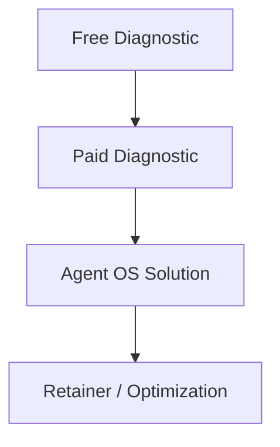
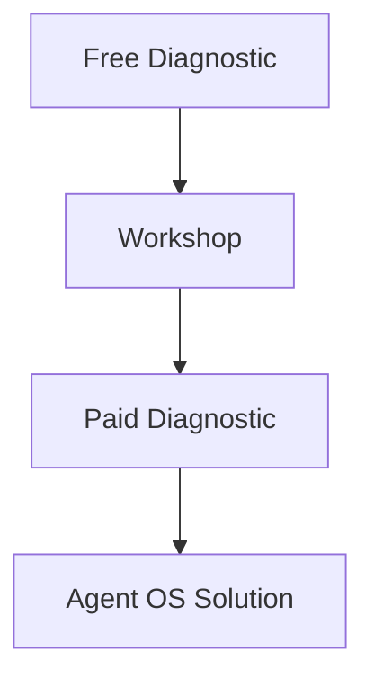
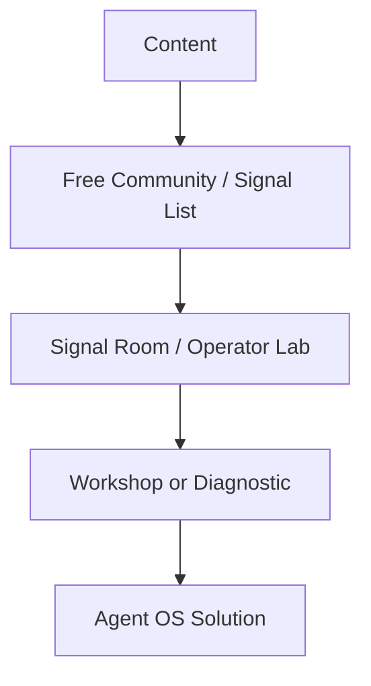
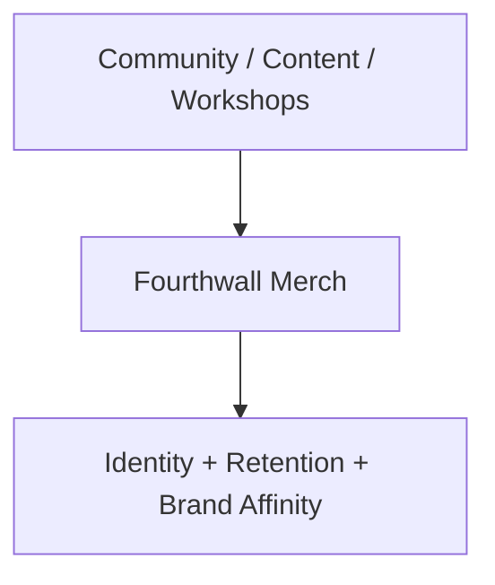

# Funnel Structures

> [!info] Four ways in. One system at the end.

## Primary business funnel

## Education funnel

## Community funnel

## Merch funnel

## Related
- [[Offer Ecosystem]] · [[Canonical Architecture]]
