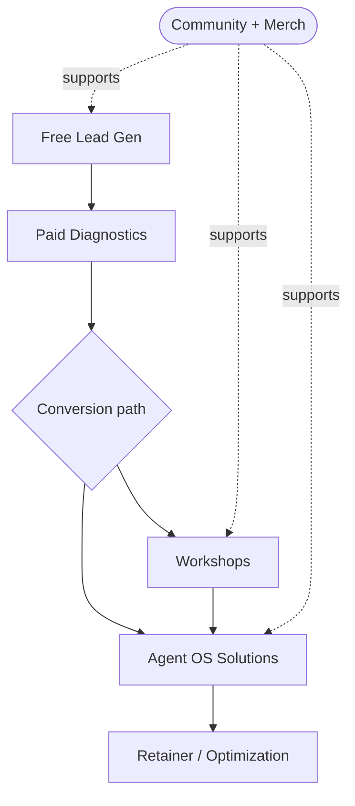

# Offer Ecosystem — Map of Content

> [!IMPORTANT]
> **Superseded 2026-07-28.** This map is preserved as historical offer-system
> context. The founder-ratified canonical strategic baseline is
> [Website Messaging and Offer Integration
> Specification](../../strategy/WEBSITE_MESSAGING_AND_OFFER_INTEGRATION_SPEC.md).
> The linked tier and product records do not override that specification.

> [!abstract] Foundational SOP
> The canonical model for how AJ Digital / Audio Jones offers connect — from free demand capture to installed Agent OS systems. This is the source of truth when building offers, pages, funnels, campaigns, or scripts. If a new offer doesn't map cleanly into a tier below, it isn't ready.

## One-line architecture
**AJ Digital helps founder-led businesses diagnose revenue leaks, operational gaps, and AI readiness — then installs Agent OS solutions that turn scattered workflows into intelligent business systems.**

## Ecosystem statement
**Start with a free diagnostic, go deeper with a paid business scan, learn through workshops, or install a full Agent OS solution. Community and merch support the movement around signal, systems, and operating leverage.**

## The master flow

> [!important] Community + merch are a *supporting layer*, never the main conversion path. They increase trust, identity, retention, and audience depth.

## The five tiers
1. [[Tier 1 - Free Lead Gen]] — capture + qualify, route into the right paid path.
2. [[Tier 2 - Paid Diagnostics]] — paid discovery → decision-ready prescription.
3. [[Tier 3 - Workshops]] — educate + qualify buyers who need clarity first.
4. [[Tier 4 - Agent OS Solutions]] — the installed systems; the money offers.
5. [[Tier 5 - Supplementary Ecosystem]] — community + merch around the systems.

## Reference notes
- [[Canonical Architecture]] — the full structure + strategic truths.
- [[Funnels]] — the four funnel structures (primary, education, community, merch).
- [[Site Navigation and Copy]] — nav grouping + clean site copy.

## Agent OS suite
- [[ResponseOS]]
- [[ReKonr OS]]
- [[PodcastOS]]
- [[Founder Intelligence System]]

## Strategic truth
> [!quote]
> Free diagnostics generate demand. Paid diagnostics create prescription. Workshops educate and qualify. Agent OS installs solve. Community retains. Merch signals identity.
