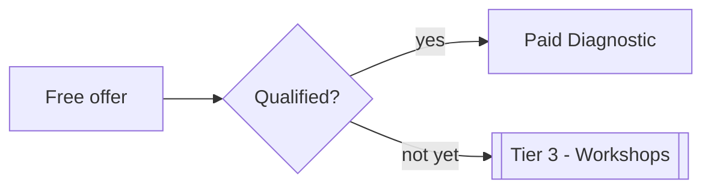

# Tier 1 — Free Lead Gen

> [!purpose] Purpose
> Capture interest, qualify leads, and route people into the right paid path. Quick, outcome-specific, and easy to understand.

## Site CTA language
**Find where your business is leaking revenue, attention, or operational clarity.**

## Offers → next step

| Free Offer | Leads To |
| --- | --- |
| Free Revenue Leak Scorecard | Paid Revenue Leak Diagnostic ([[Tier 2 - Paid Diagnostics]]) |
| Free AI Readiness Scorecard | Paid AI Readiness Diagnostic |
| Free Founder Gravity Audit | Paid Founder Intelligence Diagnostic |
| Free Missed Call / Follow-Up Audit | [[ResponseOS]] |
| Free Content System Assessment | [[PodcastOS]] |
| Free Business Memory Check | [[ReKonr OS]] |

## SOP rules
- Each free offer must map to **exactly one** paid next step.
- Outcome-specific naming only ("Revenue Leak," "Missed Call") — never generic ("Free Consultation").
- Capture the minimum to qualify and route; defer deep data to the paid diagnostic.

## Routing

## Related
- [[Offer Ecosystem]] · [[Tier 2 - Paid Diagnostics]] · [[Funnels]]
