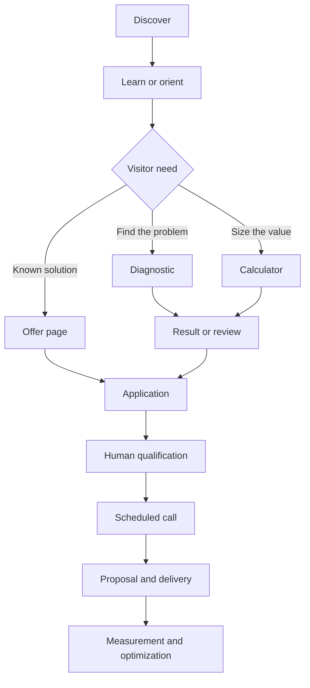
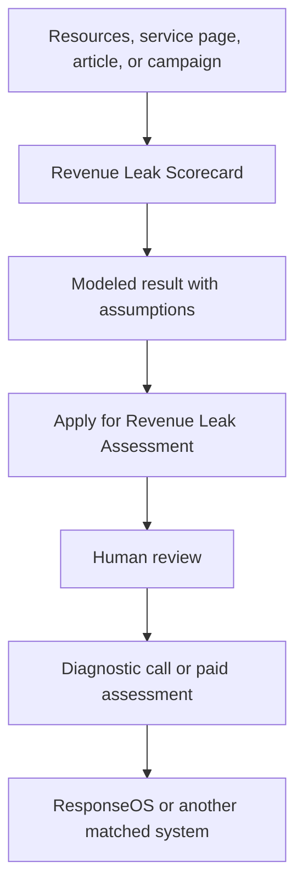
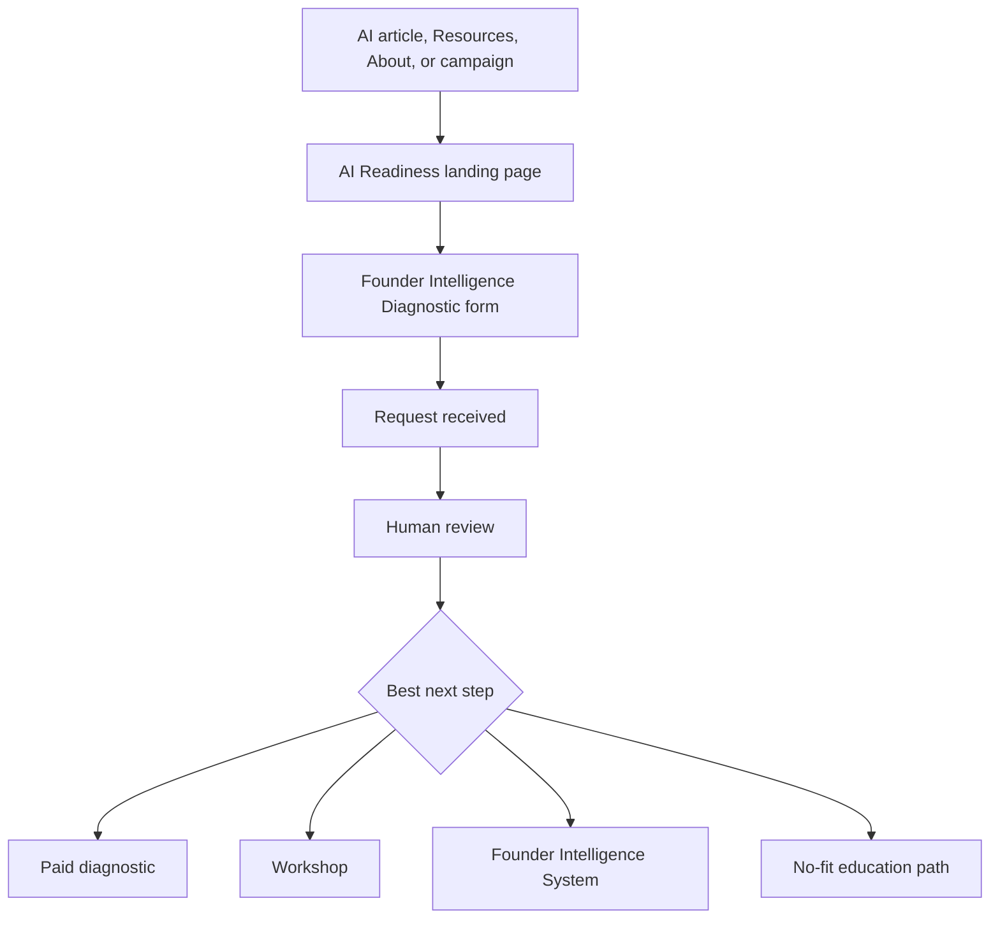
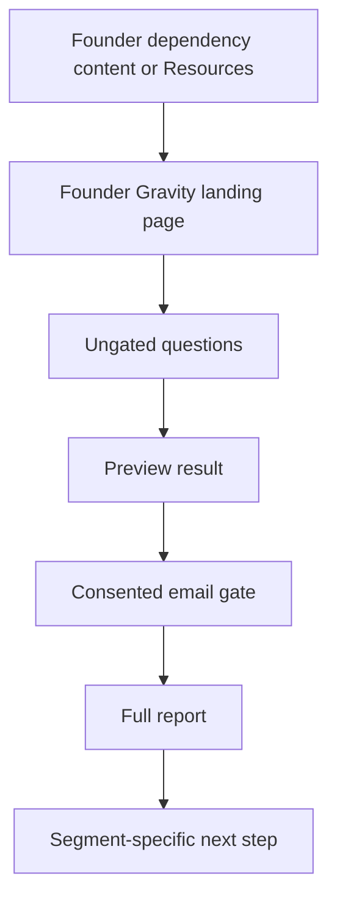
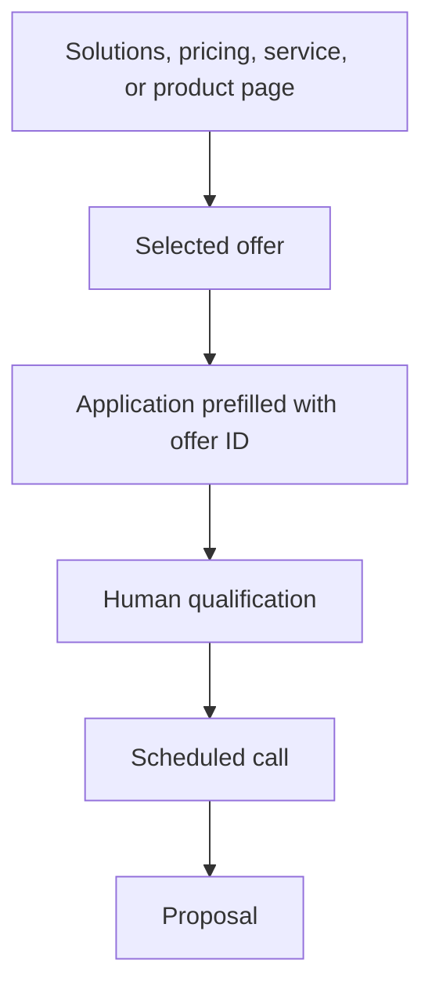
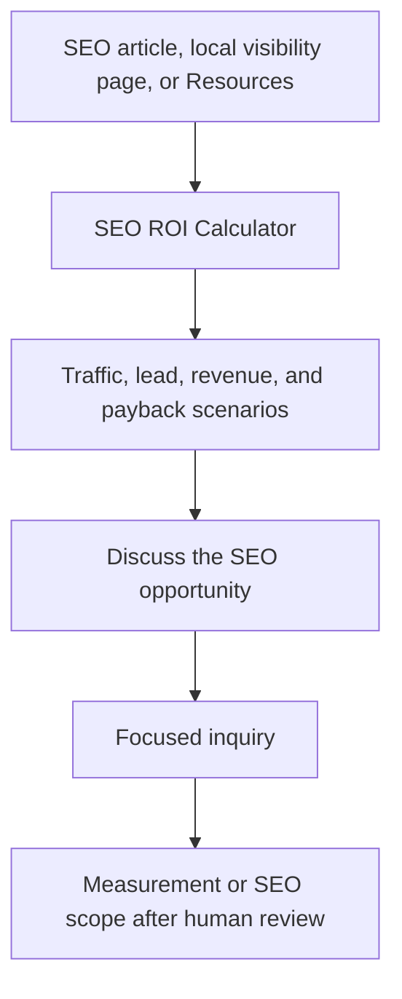
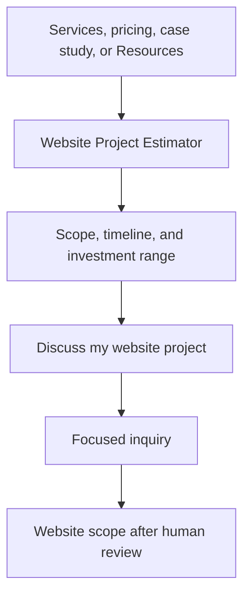
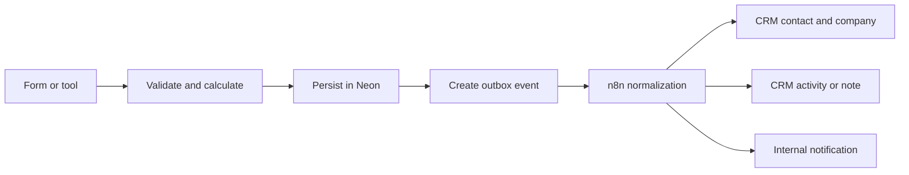

# Audio Jones Resource Funnel and CRM Canonical Map

## 1. Purpose and controlling decision

This document defines how Audio Jones resources, interactive tools, public pages, calls to action, customer journeys, attribution, and CRM handoffs fit together. Its purpose is to stop page-by-page CTA decisions, duplicated funnel logic, lost attribution, and disconnected lead records.

The recommended architecture is a governed content graph:

- `src/content/tools/index.ts` remains the source of truth for interactive tools.
- `src/content/offers.ts` remains the source of truth for commercial offers.
- `src/config/nav.ts` remains the source of truth for global navigation.
- A new `src/content/journeys/index.ts` should become the source of truth for page roles, CTA intent, internal-link relationships, funnel transitions, and CRM event mappings.
- Neon remains the durable first-party system of record for submissions and calculation evidence.
- CRM delivery occurs after successful persistence through a versioned event envelope, preferably using an outbox and n8n as the normalization layer.

This is a specification and canonical map. It does not authorize changes to production copy, routes, CRM configuration, analytics providers, pricing, or deployed code.

## 2. Evidence hierarchy

When sources conflict, use this order:

1. Current implementation at the repository evidence SHA above.
2. Ratified repository decisions and offer registries.
3. This canonical map after operator ratification.
4. Older funnel PDFs and module documents as historical intent only.

The attached Client Delivery, Funnel Map, Marketing Automation, AI Optimization, and Data Intelligence documents support the capture, nurture, delivery, measurement, and optimization loop. Their references to Beacon AI, MailerLite, Whop, Google Sheets, and Data Studio are not automatically current implementation requirements.

## 3. Current truth

### 3.1 Live and planned interactive tools

| ID | Public name | Kind | Route | Status | Current behavior | Canonical next step |
| --- | --- | --- | --- | --- | --- | --- |
| `ai-readiness-diagnostic` | AI Readiness Diagnostic | Diagnostic landing page | `/ai-readiness-diagnostic` | Live | Explains the assessment and sends users to the Founder Intelligence form | `/founder-intelligence/diagnostic` with source context |
| `founder-intelligence-diagnostic` | Founder Intelligence Diagnostic | Qualification diagnostic | `/founder-intelligence/diagnostic` | Live | Six-step request form; persists and scores the lead | Human review, then matched paid path |
| `founder-gravity-audit` | Founder Gravity Audit | Diagnostic landing page | `/founder-gravity-audit` | Live | Frames founder-dependency assessment | `/founder-gravity-audit/diagnostic` |
| `founder-gravity-instrument` | Founder Gravity Audit Instrument | Ungated diagnostic with gated full report | `/founder-gravity-audit/diagnostic` | Live | Reveals preview before email; full report requires consent | Segment-specific recommendation |
| `founder-gravity-report` | Founder Gravity Audit Report | Result page | `/founder-gravity-audit/report` | Live | Displays stored session result and segment CTA | Consulting, Founder Intelligence, ResponseOS, or network path |
| `revenue-leak-scorecard` | Revenue Leak Scorecard | Calculator and diagnostic estimator | `/roi-calculator` | Live | Models labor capacity, revenue leakage, conversion opportunity, cost avoidance, and owner capacity | Revenue Leak Assessment application |
| `seo-roi-calculator` | SEO ROI Calculator | Scenario calculator | `/seo-roi-calculator` | Planned | Not built and hidden from the Resources hub | `/book-a-call` until a ratified SEO offer exists |
| `website-project-estimator` | Website Project Estimator | Scope and price estimator | `/website-project-estimator` | Planned | Not built and hidden from the Resources hub | `/book-a-call` until a ratified website offer exists |

`AI ROI Calculator` should not become a second public calculator or duplicate route. The existing Revenue Leak Scorecard already supports an `ai_roi` preset in its calculation engine. AI ROI is therefore a scenario lens inside the Revenue Leak Scorecard unless a later product decision establishes a materially different job to be done.

The Website Project Estimator is distinct from the existing `website` ROI preset. The estimator sizes project scope, timeline, and investment. The preset models conversion economics. They must not share a misleading name.

### 3.2 Resource and authority surfaces

| ID | Route | Resource class | Primary job | Funnel role |
| --- | --- | --- | --- | --- |
| `resources-hub` | `/resources` | Resource hub | Help visitors choose a diagnostic, calculator, or learning surface | Route |
| `insights-hub` | `/insights` | Pillar-content hub | Explain problems, categories, and business implications | Educate |
| `frameworks-hub` | `/frameworks` | Intellectual-property hub | Explain how Audio Jones analyzes and organizes the work | Educate and differentiate |
| `blog-hub` | `/blog` | Search and learning hub | Capture informational demand and develop topic clusters | Discover and educate |
| `workshops` | `/workshops` | Education offer landing page | Convert teams that need education before implementation | Qualify |
| `case-studies` | `/case-studies` | Proof hub | Reduce risk with evidence and use-case proof | Validate |
| `ecosystem` | `/ecosystem` | Offer architecture map | Show how diagnostics, workshops, systems, and retainers connect | Orient |
| `founder-intelligence` | `/founder-intelligence` | Framework and solution bridge | Establish the category and route to diagnostic | Educate to diagnose |
| `responseos` | `/agents/responseos` | Product and offer landing page | Explain the managed revenue-recovery system | Convert |

Dynamic child resources include `/insights/[slug]`, `/frameworks/[slug]`, `/blog/[slug]`, and `/blog/topic/[slug]`. Each child must inherit a declared topic, problem, intended next step, and parent hub rather than using one universal CTA.

### 3.2.1 Current resource catalog

Insights currently registered:

| Title | Route | Primary topic |
| --- | --- | --- |
| What is a Founder Intelligence System? | `/insights/founder-intelligence-systems` | Founder intelligence |
| Signal vs Noise in Business | `/insights/signal-vs-noise-business` | Decision signal |
| Why AI Fails Most Companies | `/insights/why-ai-fails-most-companies` | AI readiness |
| Marketing Attribution and Causal Identification for Small Businesses | `/insights/marketing-attribution-causal-identification` | Attribution |
| What is a Revenue Leak Diagnostic? | `/insights/revenue-leak-diagnostic` | Revenue leakage |
| What is Follow-Up Intelligence? | `/insights/follow-up-intelligence` | Lead response and follow-up |
| What is Business Memory? | `/insights/business-memory` | Operational memory |

Frameworks currently registered:

| Title | Route | Primary topic |
| --- | --- | --- |
| Founder Intelligence Systems | `/frameworks/founder-intelligence-systems` | Business operating system |
| M.A.P. Meaningful Actionable Profitable | `/frameworks/map-attribution` | Decision and attribution quality |
| N.I.C.H.E Framework | `/frameworks/niche-framework` | Market positioning |
| Signal vs Noise | `/frameworks/signal-vs-noise` | Decision philosophy |

Blog topic clusters currently declared:

- Founder Intelligence Systems
- Signal vs Noise
- M.A.P. Attribution
- Why AI Fails
- AI Readiness

Workshop tracks currently shown:

- AI Readiness for Founder-Led Teams
- Revenue Recovery Systems
- Signal Over Noise Operating Model

Case-study concepts currently shown:

- Local service pipeline recovery
- Expertise to authority engine
- Attribution signal cleanup

All three current case-study cards are explicitly labeled illustrative workflows rather than verified client results. They support explanation, but they must not be treated as customer proof until evidence-backed case studies replace or supplement them.

### 3.3 Commercial and conversion surfaces

| Route | Page archetype | Primary job | Correct primary action |
| --- | --- | --- | --- |
| `/` | Brand and demand landing page | Establish relevance and route by problem | Start the most relevant diagnostic or scorecard |
| `/solutions` | Solution catalog | Help visitors identify the appropriate solution class | Request a diagnostic; direct offers may apply with a valid offer ID |
| `/services` | Service catalog | Explain engagement categories | Score the problem or send a focused inquiry |
| `/pricing` | Commercial comparison page | Clarify offer shape and starting price | Apply for the selected offer with its canonical offer ID |
| `/apply` | Qualification and scoping form | Capture deeper buying intent | Submit inquiry/application |
| `/apply/thank-you` | Confirmation page | Set expectations and preserve momentum | Explore relevant proof or learning while awaiting review |
| `/book-a-call` | Booking gateway | Explain how scheduling is granted | Start an inquiry unless a real calendar is present |
| `/about` | Trust and authority page | Establish operator credibility | Start a diagnostic; secondary link to proof or services |

## 4. Page and funnel taxonomy

The page type and the funnel role are separate fields. A page can be a landing page and also perform a diagnostic or conversion role.

| Page archetype | Definition | Navigation expectation | Conversion behavior | Current examples |
| --- | --- | --- | --- | --- |
| Brand landing page | Broad first impression for direct and branded traffic | Full navigation | Routes by visitor problem | `/` |
| Hub page | Organizes a category and distributes authority to child pages | Full navigation | Multiple contextual choices | `/resources`, `/insights`, `/frameworks`, `/blog` |
| Solution or service landing page | Explains a defined commercial capability | Full navigation | One primary commercial next step | `/agents/responseos`, `/services` |
| Tool landing page | Frames a tool before the visitor starts it | Full or reduced navigation | Start tool | `/ai-readiness-diagnostic`, `/founder-gravity-audit` |
| Tool instrument | Collects inputs and calculates or scores | Reduced distractions | Complete tool | `/roi-calculator`, `/founder-gravity-audit/diagnostic` |
| Result page | Interprets the output and recommends one next step | Reduced navigation | Result-specific CTA | `/founder-gravity-audit/report` |
| Pillar or framework page | Answers a high-intent problem or concept | Full navigation | Contextual tool CTA | `/insights/[slug]`, `/frameworks/[slug]` |
| Proof page | Validates claims using cases and evidence | Full navigation | Recreate or investigate the demonstrated outcome | `/case-studies` |
| Pricing page | Compares ratified commercial offers | Full navigation | Apply for selected offer | `/pricing` |
| Qualification page | Captures enough context to scope the next commercial action | Minimal distractions | Submit | `/apply`, `/founder-intelligence/diagnostic` |
| Booking page | Presents or grants an actual scheduling action | Minimal distractions | Schedule | No confirmed direct-booking page in the inspected implementation |
| Confirmation page | Confirms receipt and sets response expectations | Minimal distractions | Low-pressure secondary content | `/apply/thank-you`, `/founder-intelligence/diagnostic/thank-you` |
| Squeeze page | Campaign-specific page with one offer, minimal navigation, and a single conversion action | Hidden or minimal navigation | Email or registration gate | None confirmed in the current canonical public routes |

Do not call every lead-generating page a squeeze page. A squeeze page intentionally removes alternative paths. The current Resources, diagnostic landing, and calculator pages are lead-generation pages but not necessarily squeeze pages.

### 4.1 Funnel roles

Use these values for `funnelRole`:

- `discover`: capture branded, organic, referral, social, or paid attention.
- `educate`: help the visitor understand the problem and Audio Jones method.
- `orient`: show where the visitor is in the offer ecosystem.
- `diagnose`: identify or classify the problem.
- `quantify`: estimate financial or operational exposure.
- `validate`: reduce perceived risk with proof, assumptions, or methodology.
- `qualify`: capture fit, urgency, budget, and desired outcome.
- `convert`: request a defined paid engagement.
- `book`: schedule an approved conversation.
- `onboard`: begin delivery after acceptance and payment.
- `retain`: deliver ongoing insight, optimization, community, or renewal value.

## 5. Canonical customer journeys

### 5.1 Master customer journey



### 5.2 Revenue Leak Scorecard funnel



Canonical result CTA:

- Label: `Validate My Revenue Leaks`
- Destination: `/apply?source=diagnostic&offer=revenue-leak-assessment&origin_page=/roi-calculator&cta_id=roi-result-primary`
- CRM intent: `paid_diagnostic_interest`

The current label `Book a Revenue Leak Diagnostic` points to `/apply`, not a calendar. It should be changed during a separately approved copy pass because the existing label overstates what happens next.

### 5.3 AI readiness funnel



Canonical landing CTA:

- Label: `Assess AI Readiness`
- Destination: `/founder-intelligence/diagnostic?origin_page=/ai-readiness-diagnostic&cta_id=ai-readiness-start`
- CRM intent after submission: `diagnostic_review_requested`

The public name `AI Readiness Diagnostic` currently describes a landing page rather than an instant scored instrument. Copy must continue to state that it starts a review and does not produce an instant report.

### 5.4 Founder Gravity funnel



The segment-specific result CTA is directionally correct, but any route through `/book-a-call` must preserve the originating segment when it continues to `/apply`. The current booking gateway does not visibly guarantee that preservation.

### 5.5 Direct commercial funnel



Use direct application only when the visitor has selected a ratified commercial offer. Unknown or broad intent should route to a diagnostic or a generic focused inquiry, not silently assign an offer.

### 5.6 Planned SEO calculator funnel



Until a website or SEO offer exists in `src/content/offers.ts`, the CTA may route to a focused inquiry but must not invent an offer ID.

### 5.7 Planned website estimator funnel



## 6. CTA system

### 6.1 CTA rules

1. Each page has one primary CTA intent. Secondary actions may support learning or comparison but cannot compete with the primary action.
2. CTA labels must describe the action that occurs on the destination page.
3. `Book`, `Schedule`, or `Choose a time` may be used only when the next screen contains or grants actual scheduling.
4. `Apply` is used only for `/apply` or another qualification form.
5. `Get report` or `Email report` requires a report delivery action.
6. Calculator results must route by the result and the relevant offer, not universally to AI readiness.
7. Commercial CTAs use offer IDs from `src/content/offers.ts`; free-tool CTAs use tool IDs from `src/content/tools/index.ts`.
8. Internal CTA context uses `origin_page`, `cta_id`, `journey_id`, and `offer`. Do not add internal `utm_*` values because they overwrite or contaminate the true external acquisition source.
9. External campaign UTMs are captured at first landing and preserved separately as first-touch and last-external-touch attribution.
10. Analytics events never contain email, phone, free-text answers, revenue amounts, or other personally identifying or sensitive inputs.

### 6.2 Canonical CTA vocabulary

| Intent ID | Preferred label | Destination type |
| --- | --- | --- |
| `start_ai_readiness` | Assess AI Readiness | Tool landing or instrument |
| `start_founder_gravity` | Map My Gravity Load | Tool instrument |
| `start_revenue_scorecard` | Score My Revenue Leaks | Calculator instrument |
| `request_full_report` | Generate Full Report | Result gate |
| `validate_revenue_leaks` | Validate My Revenue Leaks | Prefilled application |
| `estimate_website_project` | Estimate My Website Project | Estimator instrument |
| `calculate_seo_potential` | Calculate SEO Potential | Calculator instrument |
| `discuss_website_project` | Discuss My Website Project | Focused inquiry |
| `discuss_seo_opportunity` | Discuss the SEO Opportunity | Focused inquiry |
| `apply_for_offer` | Apply for [Offer Name] | Prefilled application |
| `send_inquiry` | Tell Us What You Need | General application or inquiry |
| `schedule_call` | Schedule the Call | Actual scheduling interface only |
| `view_solution` | Explore [Solution Name] | Solution page |
| `view_pricing` | View Pricing | Pricing page |
| `read_case_study` | See the Case Study | Proof page |

### 6.3 CTA recommendations by surface

| Surface | Primary CTA | Secondary CTA | Avoid |
| --- | --- | --- | --- |
| Homepage | Problem-matched diagnostic or scorecard | Explore Solutions | Generic `Learn More` |
| Resources hub | Tool-specific action on each card | Explore library category | One universal sales CTA above every tool |
| Insight article | Most relevant diagnostic or calculator | Related framework/article | Sending every topic to AI readiness |
| Framework page | Apply the framework through a relevant tool | Related insight | Immediate booking without context |
| Case study | Model or diagnose the demonstrated issue | Explore related solution | Unsupported `Get the Same Results` |
| Services | Score or diagnose the problem | Tell Us What You Need | `Book a Call` when the page does not book |
| Solutions | Request a Diagnostic | View Pricing | Multiple equal primary buttons |
| Pricing | Apply for the selected offer | Review relevant diagnostic | Generic application that drops offer context |
| Tool landing | Start the tool | Read methodology or FAQ | Competing sales CTA before tool start |
| Tool result | One result-matched next step | Restart, save, or review assumptions | Universal AI CTA |
| Application confirmation | Set response expectation | Case study or insight | Another immediate application request |

## 7. Internal-link architecture

### 7.1 Linking principles

- Hub pages link downward to all active child resources.
- Child resources link upward to their hub and laterally to one or two strongly related resources.
- Educational pages link forward to the tool that operationalizes the topic.
- Tool landing pages link back to relevant methodology and forward to their instruments.
- Result pages link forward to exactly one recommended commercial path plus a non-commercial restart or methodology option.
- Offer pages link backward to proof and methodology, and forward to application or pricing.
- Every new public tool must be added to the Resources registry, sitemap projection, related-content rules, and funnel-event map in the same release.
- Use descriptive anchor text. Avoid `click here`, `learn more`, and repeated exact-match anchors across every page.

### 7.2 Canonical topic-to-tool links

| Topic or page cluster | Required primary tool link | Recommended supporting links |
| --- | --- | --- |
| Revenue leaks, missed calls, slow response, quote follow-up | `/roi-calculator` | `/insights/revenue-leak-diagnostic`, `/agents/responseos`, `/case-studies` |
| AI readiness, AI failures, fragmented tools | `/ai-readiness-diagnostic` | `/insights/why-ai-fails-most-companies`, `/founder-intelligence`, `/workshops` |
| Founder bottleneck, operational dependency, business memory | `/founder-gravity-audit` | `/insights/business-memory`, `/founder-intelligence`, `/frameworks/signal-vs-noise` where relevant |
| Attribution, measurement, vanity metrics | `/roi-calculator` until a dedicated measurement diagnostic exists | `/frameworks/map-attribution`, `/insights/marketing-attribution-causal-identification`, `/services` |
| ResponseOS and AI receptionist topics | `/roi-calculator?preset=responseos` when supported publicly | `/agents/responseos`, `/insights/follow-up-intelligence`, `/pricing#responseos-managed-pilot` |
| SEO, AEO, local visibility | `/seo-roi-calculator` after launch | `/services`, relevant insights, future SEO case study |
| Website conversion and redesign scope | `/website-project-estimator` after launch | `/case-studies`, `/services`, `/roi-calculator?preset=website` |

### 7.3 Required bidirectional links

| From | To | Purpose |
| --- | --- | --- |
| `/resources` | Every live tool landing or instrument | Discovery |
| Every live tool | `/resources` | Orientation and recovery |
| `/roi-calculator` | `/insights/revenue-leak-diagnostic` | Methodology and definition |
| `/insights/revenue-leak-diagnostic` | `/roi-calculator` | Operationalize the insight |
| `/ai-readiness-diagnostic` | `/founder-intelligence/diagnostic` | Continue the declared journey |
| `/founder-intelligence/diagnostic` | `/ai-readiness-diagnostic` or `/founder-intelligence` | Context and recovery |
| `/founder-gravity-audit` | `/founder-gravity-audit/diagnostic` | Start instrument |
| `/founder-gravity-audit/report` | Segment-matched solution | Convert by result |
| `/agents/responseos` | `/roi-calculator?preset=responseos` | Quantify before applying |
| `/roi-calculator` result | `/apply` with revenue-leak offer ID | Qualify commercial intent |
| `/pricing` | `/apply` with selected offer ID | Preserve offer intent |

## 8. Dynamic registry and schema

### 8.1 Do not create a competing mega-registry

The journey layer should reference existing tool, offer, and navigation IDs. It should not duplicate their public names, prices, or descriptions. This avoids three files disagreeing about the same entity.

Recommended file ownership:

| Concern | Canonical file |
| --- | --- |
| Tool identity, kind, route, status, card copy | `src/content/tools/index.ts` |
| Offer identity, commercial data, evidence status | `src/content/offers.ts` |
| Main navigation | `src/config/nav.ts` |
| Page role, CTA intent, journey edges, CRM event | `src/content/journeys/index.ts` |
| Shared CTA destination builder and context parameters | `src/config/links.ts` |
| Sitemap | Derived from live public registries plus dynamic CMS content |
| Resources hub cards | Derived from live tool registry and resource-category registry |
| Funnel QA | Tests that validate registry references and live-route resolution |

### 8.2 Recommended TypeScript contract

```ts
export type LifecycleStatus = "live" | "planned" | "deprecated";

export type PageArchetype =
  | "brand-landing"
  | "hub"
  | "solution-landing"
  | "tool-landing"
  | "tool-instrument"
  | "result"
  | "pillar"
  | "proof"
  | "pricing"
  | "qualification"
  | "booking"
  | "confirmation"
  | "squeeze";

export type FunnelRole =
  | "discover"
  | "educate"
  | "orient"
  | "diagnose"
  | "quantify"
  | "validate"
  | "qualify"
  | "convert"
  | "book"
  | "onboard"
  | "retain";

export type CtaIntent =
  | "start-tool"
  | "continue-tool"
  | "request-report"
  | "apply"
  | "send-inquiry"
  | "schedule"
  | "view-solution"
  | "view-pricing"
  | "read-proof"
  | "read-related";

export type JourneyPage = {
  id: string;
  route: string;
  status: LifecycleStatus;
  archetype: PageArchetype;
  funnelRoles: FunnelRole[];
  parentId?: string;
  toolId?: string;
  offerId?: string;
  primaryCta: JourneyCta;
  secondaryCtas?: JourneyCta[];
  requiredInboundFrom?: string[];
  requiredOutboundTo?: string[];
  submissionEvent?: string;
  indexable: boolean;
};

export type JourneyCta = {
  id: string;
  intent: CtaIntent;
  label: string;
  destination: string;
  toolId?: string;
  offerId?: string;
  crmIntent?: string;
};

export type JourneyDefinition = {
  id: string;
  name: string;
  entryPageIds: string[];
  orderedPageIds: string[];
  successEvent: string;
  fallbackPageId?: string;
};
```

### 8.3 Selector behavior

The implementation should export selectors rather than letting pages filter ad hoc:

```ts
getLiveTools()
getToolsByKind(kind)
getPageByRoute(route)
getPrimaryCta(pageId)
getRelatedPages(pageId)
getJourney(journeyId)
getOfferDestination(offerId, context)
getSitemapRoutes()
```

Validation must fail when:

- a live entity points to a missing route;
- a journey references an unknown page, tool, CTA, or offer ID;
- a planned tool is rendered as live;
- a `schedule` CTA points to a non-booking page;
- an `apply` CTA uses an unknown offer ID;
- a public result page has no declared next step;
- a child resource lacks a parent hub;
- internal CTA builders add `utm_*` values;
- two primary CTAs are declared for one page state.

## 9. CRM and data architecture

### 9.1 Current implementation truth

| Flow | Durable persistence | Notification | CRM or automation webhook | Gap |
| --- | --- | --- | --- | --- |
| Founder Intelligence Diagnostic | Neon | Resend | `applied_intelligence_lead_created` through n8n/CRM webhook | Event lacks a shared envelope and complete attribution |
| Founder Gravity Audit | Neon through its dedicated lead table | Resend | `founder_gravity_audit_lead_created` through n8n/CRM webhook | Separate schema and event vocabulary |
| Application | Neon when the production provider is configured | Resend | `apply_submission_created` through n8n/CRM webhook | Separate schema; no shared journey identifier |
| Revenue Leak Scorecard | Neon | Agency and client email | None confirmed in inspected route | Does not feed CRM despite being high-value intent |
| Newsletter | Separate lightweight subscription path | Provider-dependent | Separate from lead pipeline | Must not be treated as qualified commercial intent by default |

### 9.2 Canonical handoff



Persistence must succeed before CRM delivery is attempted. CRM or notification failure must not lose the original submission. A durable outbox is preferred over best-effort fire-and-forget webhooks because serverless retries and downstream outages are normal operating conditions.

### 9.3 Canonical CRM event envelope

```json
{
  "event_id": "uuid",
  "event_name": "tool_submission_created",
  "event_version": "1.0",
  "occurred_at": "ISO-8601",
  "source_system": "audiojones.com",
  "journey": {
    "journey_id": "revenue-leak-to-assessment",
    "session_id": "opaque-id",
    "origin_page": "/insights/revenue-leak-diagnostic",
    "submission_page": "/roi-calculator",
    "cta_id": "roi-result-primary"
  },
  "identity": {
    "email": "server-side-only",
    "first_name": null,
    "last_name": null,
    "phone": null,
    "company_name": null,
    "website": null
  },
  "consent": {
    "contact": true,
    "captured_at": "ISO-8601",
    "text_version": "consent-v1"
  },
  "asset": {
    "tool_id": "revenue-leak-scorecard",
    "tool_version": "v2-geo-economic",
    "submission_id": "database-id"
  },
  "result_summary": {
    "segment": "Pilot First",
    "score": null,
    "confidence": "medium",
    "primary_signal": "Missed calls",
    "recommended_offer_id": "revenue-leak-assessment"
  },
  "attribution": {
    "first_touch": {},
    "last_external_touch": {},
    "internal_origin": {
      "page": "/insights/revenue-leak-diagnostic",
      "cta_id": "insight-revenue-scorecard",
      "journey_id": "revenue-leak-to-assessment"
    }
  },
  "delivery": {
    "attempt": 1,
    "idempotency_key": "event_id"
  }
}
```

The full calculation inputs, answers, assumptions, and result objects remain in Neon. Send the CRM a concise outcome summary and the durable submission ID rather than forcing large JSON objects into contact properties.

### 9.4 Recommended CRM object behavior

| Trigger | Contact | Company | Activity or note | Deal |
| --- | --- | --- | --- | --- |
| Anonymous tool start | No create | No create | Analytics only, no PII | Never |
| Tool result viewed without contact consent | No create | No create | Aggregate analytics only | Never |
| Consented report or scorecard submission | Create or update by normalized email | Associate when company evidence exists | Add tool result summary and submission ID | Do not create automatically |
| Founder Intelligence request | Create or update | Associate | Add diagnostic scores and stated constraint | Do not create until fit review |
| Application submitted | Create or update | Associate | Add offer, desired outcome, timeline, budget, and source | Create only if AJ Digital's pipeline policy defines application as an opportunity |
| Call scheduled | Update lifecycle stage | Associate | Log scheduling event | Create or advance opportunity according to pipeline policy |
| Proposal sent or accepted | Update lifecycle stage | Associate | Log proposal event | Create or advance deal |

Do not mark every calculator user as an MQL or create a sales deal. Tool completion signals interest; application and human review establish commercial qualification.

### 9.5 Minimum normalized CRM properties

Contact-level:

- `first_conversion_asset_id`
- `latest_conversion_asset_id`
- `latest_submission_id`
- `latest_result_segment`
- `latest_primary_signal`
- `latest_confidence_tier`
- `latest_recommended_offer_id`
- `journey_id`
- `first_touch_source`, `first_touch_medium`, `first_touch_campaign`
- `last_external_source`, `last_external_medium`, `last_external_campaign`
- `internal_origin_page`, `internal_cta_id`
- `consent_status`, `consent_timestamp`, `consent_text_version`
- `qualification_status`
- `lead_owner`

Company-level:

- company name, domain, industry, employee band, revenue band, location;
- primary operational constraint;
- known CRM, analytics, automation, and process maturity signals;
- most recent recommended system or engagement.

Activity or note:

- tool or form name and version;
- human-readable result summary;
- important assumptions and whether inputs were measured or estimated;
- desired outcome and timing;
- canonical submission ID and internal review link.

## 10. Analytics and measurement schema

### 10.1 Event vocabulary

| Event | Trigger | Allowed properties |
| --- | --- | --- |
| `resource_viewed` | Resource or tool landing rendered | `resource_id`, `page_id`, `journey_id` |
| `tool_started` | First meaningful input | `tool_id`, `tool_version`, `journey_id` |
| `tool_step_completed` | Step transition | `tool_id`, `step_id`, `step_number` |
| `tool_preview_viewed` | Ungated preview rendered | `tool_id`, `segment`, `confidence` |
| `tool_result_requested` | Consented result gate submitted | `tool_id`, `journey_id` |
| `tool_result_viewed` | Full result rendered | `tool_id`, `segment`, `confidence`, `assumptions_overridden` |
| `cta_clicked` | Declared CTA selected | `cta_id`, `page_id`, `destination_id`, `journey_id` |
| `application_started` | First application input | `origin_page`, `offer_id`, `journey_id` |
| `application_submitted` | Application accepted | `offer_id`, `journey_id` |
| `booking_completed` | Actual scheduling confirmed | `journey_id`, `call_type` |

No analytics event may contain personal identifiers, exact financial inputs, free-text answers, or full diagnostic results.

### 10.2 Funnel metrics

Measure each journey as a sequence, not as isolated page views:

- resource-to-tool start rate;
- tool start-to-completion rate;
- result reveal rate;
- consented result request rate;
- result-to-application rate;
- application acceptance and no-fit rate;
- application-to-booked-call rate;
- booked-call-to-proposal rate;
- proposal-to-close rate;
- time between each stage;
- revenue and gross profit attributed to the originating asset and journey;
- drop-off by device, acquisition channel, tool, and step.

## 11. UI and UX map

### 11.1 Resources hub hierarchy

The Resources page should remain a selection hub with this order:

1. Clear value proposition.
2. Live diagnostics.
3. Live calculators and estimators.
4. Topic pathways that explain when to use each tool.
5. Library categories: Insights, Frameworks, Blog, Workshops, Case Studies.
6. A low-pressure fallback for visitors who are unsure.

Planned tools remain hidden until the route, calculation logic, result experience, persistence, and QA gates are complete.

### 11.2 Tool UX contract

Every diagnostic or calculator must include:

1. Outcome-first title and explanation.
2. Clear statement of what the visitor will receive.
3. Time or step expectation.
4. Ungated start whenever practical.
5. Visible progress for multi-step instruments.
6. Plain-language input guidance and validation.
7. Result or preview before an email gate where commercially safe.
8. Visible assumptions, sources, evidence date, and confidence limits for calculated outputs.
9. Consent separated from calculation.
10. One result-specific primary CTA.
11. Restart, edit answers, or return-to-resources recovery path.
12. Mobile controls with at least 44-pixel targets and no horizontal overflow.

### 11.3 Result hierarchy

Display results in this order:

1. Primary result or segment.
2. Meaning in plain language.
3. Highest-leverage signal.
4. Confidence and evidence quality.
5. Breakdown.
6. Assumptions and exclusions.
7. Recommended next action and why it matches.
8. Secondary restart or learning option.

## 12. Known gaps and conflicts

| Priority | Gap | Evidence | Required resolution |
| --- | --- | --- | --- |
| P0 | Revenue Leak Scorecard does not send a confirmed CRM/n8n event | API route persists and emails but contains no CRM handoff | Add versioned post-persistence event with durable retry |
| P0 | Internal links use `utm_*` parameters | ROI and ResponseOS application URLs set internal website UTMs | Separate internal journey context from external acquisition UTMs |
| P0 | `Book a Revenue Leak Diagnostic` lands on an application | Current scorecard preset CTA | Rename to the action that actually occurs or add genuine booking |
| P0 | `/book-a-call` describes scheduling but routes users to `/apply` | Current booking gateway | Either implement scheduling or reposition as an inquiry gateway |
| P1 | Three lead systems use different event envelopes and storage conventions | Founder Intelligence, Founder Gravity, Application, and ROI code paths | Introduce canonical envelope and shared delivery contract without forcing a risky one-shot migration |
| P1 | Founder Gravity segment parameters may be lost when the booking gateway continues to application | Result CTA adds query parameters; booking page uses hardcoded links | Preserve journey and segment context across the transition |
| P1 | AI Readiness landing and Founder Intelligence form use different public concepts | One page promises readiness framing; the instrument is broader | Declare the relationship in registry and CRM asset fields |
| P1 | Sitemap is manually maintained and can drift from the tool registry | Static tool routes are listed separately | Derive live tool routes from registry with explicit priority metadata |
| P1 | Resources library list and thematic list are hardcoded in the page | `src/app/resources/page.tsx` | Move resource categories and topic relationships into content registries |
| P1 | Current case-study cards are illustrative, not verified customer outcomes | Each card carries `Illustrative workflow — not a client result` | Preserve the disclaimer and avoid routing them as strong proof until evidence-backed cases exist |
| P2 | SEO ROI and Website Project tools are planned but not built | Tool registry marks both `planned` | Keep hidden until formulas, commercial inputs, persistence, and QA are ratified |
| P2 | `ctaLinks.contactUs` points to `/contact`, but no public `/contact` page is confirmed | `src/config/links.ts` and route inventory | Remove, replace, or implement only through a separately approved route decision |
| P2 | Older module documents name platforms that may no longer be canonical | Attached PDFs versus current AGENTS stack | Mark legacy architecture historical; do not implement from it blindly |

## 13. Implementation sequence

### Phase 0: Ratify the model

- Approve the page taxonomy, CTA vocabulary, journey IDs, attribution separation, and CRM lifecycle rules.
- Decide whether `/book-a-call` becomes a real scheduling page or a clearly named inquiry gateway.
- Decide whether an application creates a CRM deal immediately or only after human qualification.

### Phase 1: Add the canonical journey registry

- Create `src/content/journeys/index.ts` with references to existing tools and offers.
- Add route, reference, CTA-semantic, and internal-UTM validation tests.
- Derive Resources and sitemap projections where this can be done without changing public copy.
- Preserve current routes; no redirect work is required for this phase.

### Phase 2: Normalize attribution and CTA context

- Capture external acquisition UTMs at first landing.
- Replace internal UTMs with `origin_page`, `cta_id`, `journey_id`, and `offer` context.
- Preserve context through diagnostic, result, application, thank-you, and booking transitions.
- Update CTA labels only after copy approval.

### Phase 3: Normalize CRM delivery

- Define the `tool_submission_created`, `diagnostic_request_created`, and `application_created` envelopes under one versioned contract.
- Add Revenue Leak Scorecard CRM delivery.
- Add durable outbox and idempotent delivery.
- Normalize in n8n and upsert CRM contact/company records.
- Store full evidence in Neon; attach concise summaries to CRM activities.

### Phase 4: Complete planned tools

- Build the SEO ROI Calculator only after CTR sources, ramp assumptions, and evidence-date policy are ratified.
- Build the Website Project Estimator only after price bands and included-scope rules reconcile with the pricing registry.
- Route both to focused inquiry until matching offers are ratified.

### Phase 5: Measure and optimize

- Instrument the canonical event vocabulary.
- Build journey dashboards from the declared funnel stages.
- Review quarterly for orphan pages, CTA mismatch, internal-link gaps, conversion leakage, and stale assumptions.

## 14. Governance and update procedure

This document should be implemented in the repository as relationships between existing registries, not maintained forever as a manually synchronized spreadsheet.

For every new resource, tool, page, or offer:

1. Create or select its stable ID.
2. Classify its lifecycle status, page archetype, and funnel role.
3. Register its public route and indexability.
4. Assign one primary CTA intent and destination.
5. Assign its parent hub and required internal links.
6. Assign its journey and conversion-success event.
7. Define persistence, consent, analytics, and CRM behavior.
8. Validate every referenced tool and offer ID.
9. Update tests, sitemap projection, and changelog in the same PR.
10. Do not mark it live until the destination route and its downstream conversion action pass preview validation.

Quarterly review must identify:

- live registry entries with missing or broken routes;
- public routes absent from the journey registry;
- pages with misleading CTA labels;
- pages with no inbound internal links;
- tools with no CRM delivery or reproducible evidence snapshot;
- internal UTMs contaminating acquisition fields;
- planned resources accidentally exposed;
- stale benchmark dates and calculation assumptions;
- conversion paths that create loops or dead ends;
- deprecated pages lacking a redirect or retirement decision.

## 15. Ratification decisions required

The following decisions materially change implementation and require operator approval:

1. Ratify this document as the canonical resource, journey, CTA, and CRM relationship model.
2. Approve the new `src/content/journeys/index.ts` registry boundary.
3. Approve replacing internal UTMs with separate internal journey context.
4. Choose the future of `/book-a-call`:
   - actual scheduling page; or
   - inquiry gateway renamed and rewritten to match its behavior.
5. Decide the CRM deal-creation threshold:
   - application submission; or
   - human-qualified opportunity.
6. Approve the shared CRM event envelope and durable outbox direction.
7. Approve the proposed CTA wording before public copy changes.

## 16. Acceptance criteria

The architecture is complete when:

- one stable ID identifies every public resource, tool, page, CTA, journey, and commercial offer;
- Resources, sitemap, related links, and CTA destinations are derived from governed registries where appropriate;
- every live page has a declared archetype, funnel role, parent, primary CTA, and success event;
- every live tool produces a useful result, stores reproducible evidence, and creates an idempotent CRM event after consent;
- external attribution survives internal navigation unchanged;
- CRM records show the originating resource, result summary, next-step recommendation, and later commercial outcome;
- no CTA promises scheduling, a report, a score, or an application unless the destination performs that action;
- planned tools cannot appear publicly until their complete path passes validation;
- funnel dashboards can calculate conversion and time-to-stage from discovery through closed work;
- automated tests reject broken routes, unknown IDs, CTA-semantic mismatches, and internal UTM contamination.

## 17. Source references

Repository evidence inspected at `c1782c92fcc0f2bd721f60bc78f9133ac482b9a2`:

- `AGENTS.md`
- `src/content/tools/index.ts`
- `src/content/offers.ts`
- `src/config/nav.ts`
- `src/config/links.ts`
- `src/app/resources/page.tsx`
- `src/app/sitemap.ts`
- `src/app/roi-calculator/page.tsx`
- `src/lib/roi-calculator/presets.ts`
- `src/app/api/roi-calculator/lead/route.ts`
- `src/app/ai-readiness-diagnostic/page.tsx`
- `src/app/founder-intelligence/diagnostic/page.tsx`
- `src/app/api/founder-intelligence/leads/route.ts`
- `src/app/founder-gravity-audit/page.tsx`
- `src/app/founder-gravity-audit/diagnostic/page.tsx`
- `src/lib/founder-gravity-audit/content.ts`
- `src/app/api/founder-gravity-audit/leads/route.ts`
- `src/app/apply/page.tsx`
- `src/app/api/apply/route.ts`
- `docs/specs/resources-tools-expansion-prd.md`
- `docs/specs/revenue-leak-scorecard-v2-geo-economic-engine.md`
- `docs/sop/offer-ecosystem/Offer Ecosystem.md`
- `docs/sop/offer-ecosystem/Funnels.md`
- `docs/sop/offer-ecosystem/Tier 1 - Free Lead Gen.md`

Historical intent reviewed:

- Client Delivery Module
- Audio Jones Funnel Map
- Marketing Automation Module
- AI Optimization Module
- Data Intelligence Module
