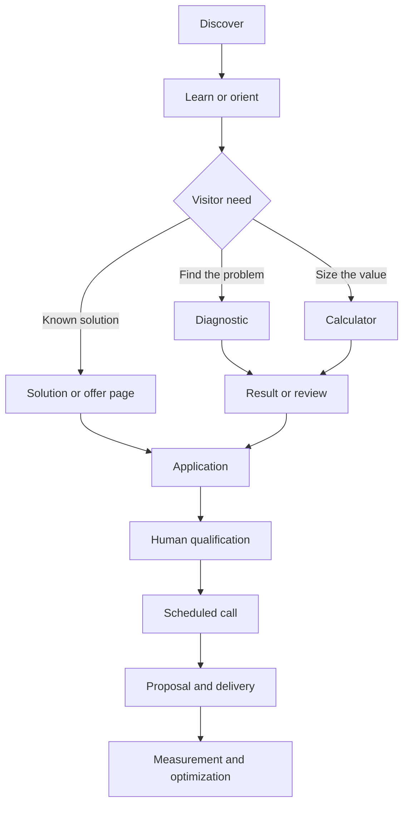
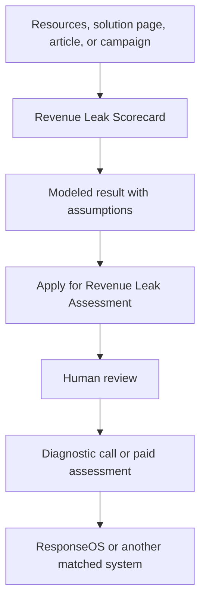
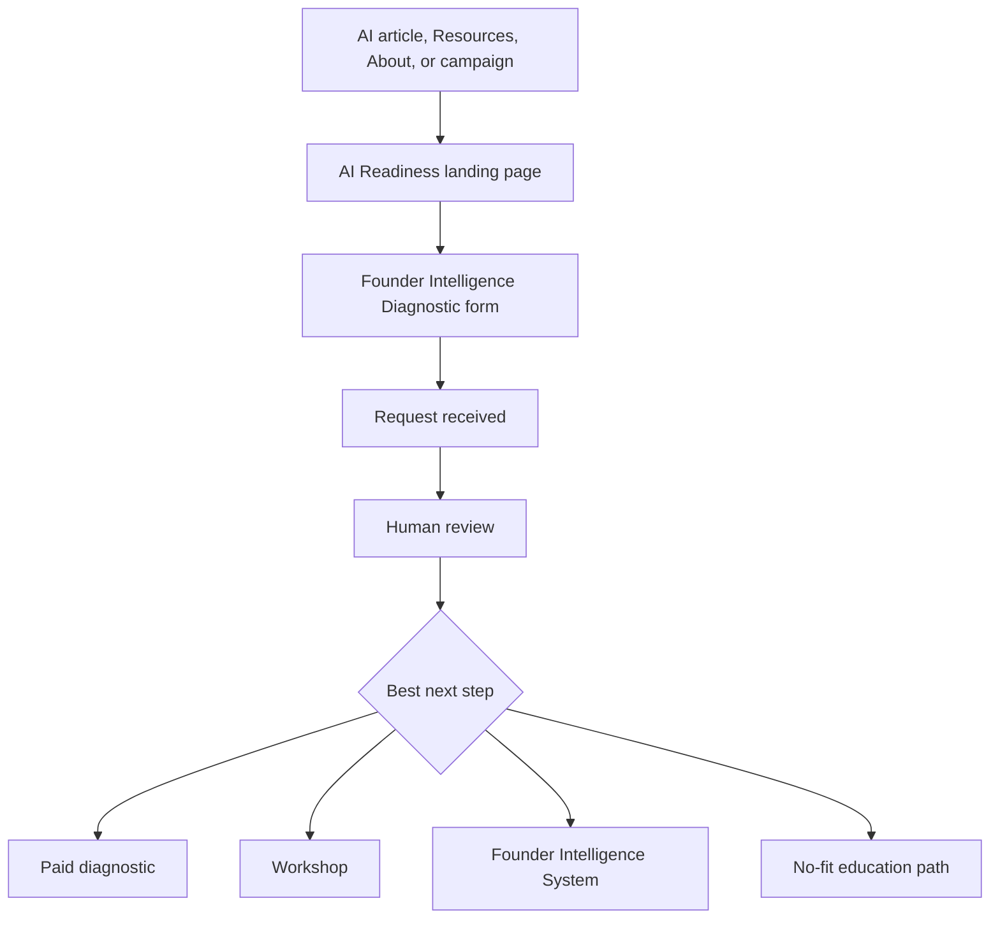
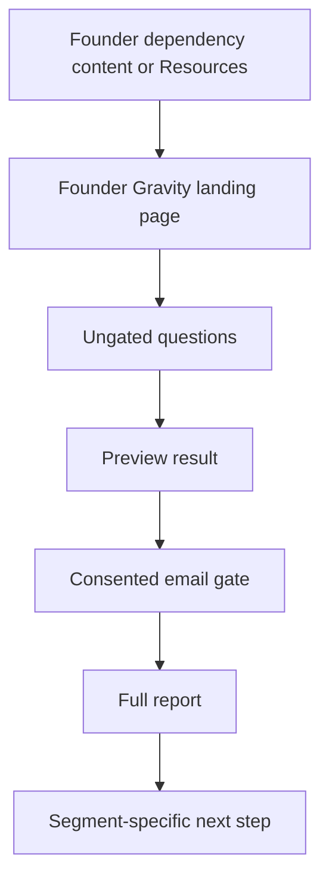
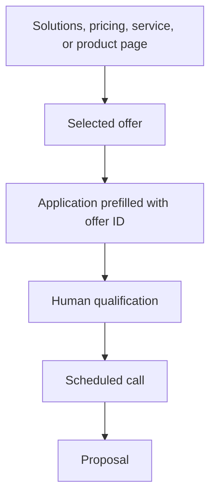
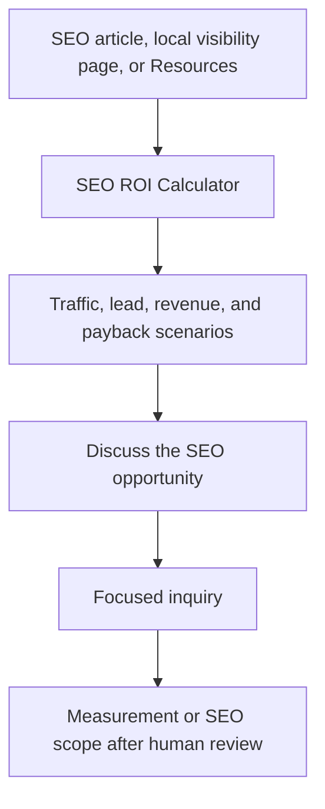
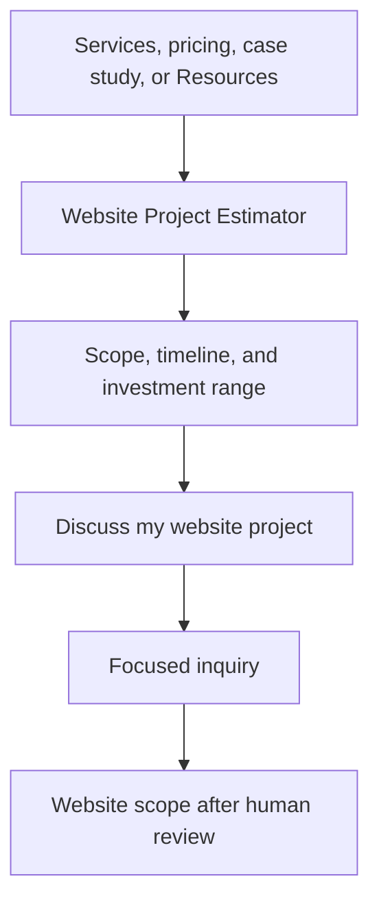
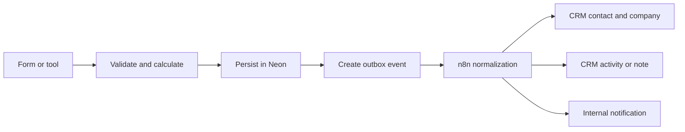

# Audio Jones Resource Funnel and CRM Canonical Map v1.1

## 0. Change summary from v1.0

Version 1.1 preserves the funnel, CTA, attribution, CRM, persistence, analytics, and governance model established in v1.0 and adds the missing site-architecture contract required to make that model enforceable across the public website.

The material additions are:

1. **Canonical hierarchical navigation**
   - `Solutions` and `Resources` become governed parent navigation nodes with child destinations.
   - Desktop uses accessible dropdown or mega-menu behavior.
   - Mobile uses nested accordion behavior.
   - Parent destinations remain valid direct links.
   - Planned, missing, deprecated, or non-public routes cannot appear in navigation.

2. **Canonical solution-page architecture**
   - `/solutions` remains the primary human-facing commercial hub.
   - Solution family hubs and buyer-facing solution detail pages are governed by the offer and journey registries.
   - Existing strong canonical routes such as `/agents/responseos` and `/founder-intelligence` remain canonical unless a separately approved redirect plan changes them.
   - Pricing tiers and internal implementation components do not automatically receive standalone SEO pages.

3. **Registry-derived sitemap**
   - Sitemap inclusion is based on lifecycle status, indexability, canonical ownership, and route existence.
   - Planned tools, deprecated routes, redirects, thank-you pages, internal result pages, and qualification-only forms are excluded unless explicitly declared indexable.
   - `lastModified` must use a real content or registry date when available and must otherwise be omitted.
   - The sitemap must never stamp every route with build time via `new Date()`.

4. **Canonical internal-link graph**
   - Resources, solutions, tools, insights, frameworks, proof, pricing, and applications participate in declared bidirectional relationships.
   - Internal links are validated as graph edges rather than added ad hoc per page.

5. **Navigation/sitemap validation**
   - Automated tests reject unknown routes, duplicate sitemap URLs, planned entities exposed as live, orphan pages, child nav links to missing routes, sitemap entries for non-indexable pages, and canonical mismatches.

This remains a specification and canonical map. It does **not** authorize production deployment, route deletion, route renaming, pricing changes, public copy changes, CRM configuration changes, or analytics-provider installation.

---

## 1. Purpose and controlling decision

This document defines how Audio Jones resources, interactive tools, commercial solutions, public pages, navigation, calls to action, customer journeys, attribution, sitemap behavior, canonical URLs, internal links, persistence, analytics, and CRM handoffs fit together.

Its purpose is to stop:

- page-by-page CTA decisions;
- duplicated funnel logic;
- duplicated commercial definitions;
- navigation drift;
- sitemap drift;
- orphan pages;
- thin or duplicate solution pages;
- lost attribution;
- misleading CTA semantics;
- disconnected lead records;
- inconsistent CRM events;
- planned resources leaking into production;
- search-engine ambiguity about canonical page ownership.

The controlling architecture is a governed content and journey graph:

- `src/content/tools/index.ts` remains the source of truth for interactive tools.
- `src/content/offers.ts` remains the source of truth for commercial offers.
- `src/config/nav.ts` remains the source of truth for global navigation hierarchy and ordering.
- A new `src/content/journeys/index.ts` becomes the source of truth for page roles, lifecycle status, canonical route ownership, CTA intent, internal-link relationships, funnel transitions, indexability, sitemap eligibility, and CRM event mappings.
- Resource-category content must move out of hardcoded page-local arrays into governed content registries where it is reused by navigation, hubs, related-content selectors, or sitemap logic.
- Existing Insight, Framework, and CMS registries remain authoritative for their own child content.
- Neon remains the durable first-party system of record for submissions and calculation evidence.
- CRM delivery occurs after successful persistence through a versioned event envelope, preferably using a durable outbox with n8n as the normalization layer.
- `buildMetadata()` remains the canonical mechanism for self-referencing canonical URLs unless a route has an explicitly approved canonical override.

The implementation objective is not to create one giant registry. It is to create **clear ownership boundaries with validated references between registries**.

---

## 2. Evidence hierarchy

When sources conflict, use this order:

1. Current implementation at the repository evidence SHA above.
2. Ratified repository decisions, architecture docs, tool registries, offer registries, and route contracts.
3. This canonical map after operator ratification.
4. Older funnel PDFs and module documents as historical intent only.

The attached Client Delivery, Funnel Map, Marketing Automation, AI Optimization, and Data Intelligence documents support the capture, nurture, delivery, measurement, and optimization loop. Their references to Beacon AI, MailerLite, Whop, Google Sheets, Google Business Ultra, Data Studio, GHL, and similar platforms are not automatically current implementation requirements.

### 2.1 Repository evidence used for the v1.1 navigation and sitemap amendment

The v1.1 amendment was verified against `main` at:

```txt
10881d0aaf8267c97215d131f4709a390add2e0d
```

At that evidence point:

- `src/config/nav.ts` defines `NavItem.children?: NavItem[]`.
- `src/components/Header.tsx` renders `mainNav` as a flat list on both desktop and mobile and does not render `children`.
- `src/components/Footer.tsx` consumes the same top-level `mainNav` but does not expose grouped descendants.
- `src/app/sitemap.ts` maintains a manual static-route array.
- `src/app/sitemap.ts` sets `const now = new Date()` and uses that build-time value as `lastModified` for static routes, Frameworks, and Insights.
- `src/app/resources/page.tsx` contains hardcoded library and theme arrays while interactive tools come from `src/content/tools/index.ts`.
- `/solutions` maintains a page-local commercial stage structure even though `src/content/offers.ts` declares itself the canonical commercial registry.

Those are architecture gaps, not merely presentation issues.

---

## 3. Current truth

### 3.1 Live and planned interactive tools

| ID | Public name | Kind | Route | Status | Current behavior | Canonical next step |
| --- | --- | --- | --- | --- | --- | --- |
| `ai-readiness-diagnostic` | AI Readiness Diagnostic | Diagnostic landing page | `/ai-readiness-diagnostic` | Live | Explains the assessment and sends users to the Founder Intelligence form | `/founder-intelligence/diagnostic` with source context |
| `founder-intelligence-diagnostic` | Founder Intelligence Diagnostic | Qualification diagnostic | `/founder-intelligence/diagnostic` | Live | Six-step request form; persists and scores the lead | Human review, then matched paid path |
| `founder-gravity-audit` | Founder Gravity Audit | Diagnostic landing page | `/founder-gravity-audit` | Live | Frames founder-dependency assessment | `/founder-gravity-audit/diagnostic` |
| `founder-gravity-instrument` | Founder Gravity Audit Instrument | Ungated diagnostic with gated full report | `/founder-gravity-audit/diagnostic` | Live | Reveals preview before email; full report requires consent | Segment-specific recommendation |
| `founder-gravity-report` | Founder Gravity Audit Report | Result page | `/founder-gravity-audit/report` | Live | Displays stored session result and segment CTA | Consulting, Founder Intelligence, ResponseOS, or network path |
| `revenue-leak-scorecard` | Revenue Leak Scorecard | Calculator and diagnostic estimator | `/roi-calculator` | Live | Models labor capacity, revenue leakage, conversion opportunity, cost avoidance, and owner capacity | Revenue Leak Assessment application |
| `seo-roi-calculator` | SEO ROI Calculator | Scenario calculator | `/seo-roi-calculator` | Planned | Not built and hidden from the Resources hub | Focused inquiry until a ratified SEO offer exists |
| `website-project-estimator` | Website Project Estimator | Scope and price estimator | `/website-project-estimator` | Planned | Not built and hidden from the Resources hub | Focused inquiry until a ratified website offer exists |

`AI ROI Calculator` must not become a second public calculator or duplicate route. The existing Revenue Leak Scorecard already supports an `ai_roi` scenario lens. AI ROI remains a scenario inside the Revenue Leak Scorecard unless a later product decision establishes a materially different job to be done.

The Website Project Estimator remains distinct from any website-conversion scenario in the Revenue Leak Scorecard. The estimator sizes project scope, timeline, and investment. The scorecard models operational or conversion economics.

### 3.2 Resource and authority surfaces

| ID | Route | Resource class | Primary job | Funnel role |
| --- | --- | --- | --- | --- |
| `resources-hub` | `/resources` | Resource hub | Help visitors choose a diagnostic, calculator, or learning surface | Orient |
| `insights-hub` | `/insights` | Pillar-content hub | Explain problems, categories, and business implications | Educate |
| `frameworks-hub` | `/frameworks` | Intellectual-property hub | Explain how Audio Jones analyzes and organizes the work | Educate and differentiate |
| `blog-hub` | `/blog` | Search and learning hub | Capture informational demand and develop topic clusters | Discover and educate |
| `workshops` | `/workshops` | Education offer landing page | Convert teams that need education before implementation | Qualify |
| `case-studies` | `/case-studies` | Proof hub | Reduce risk with evidence and use-case proof | Validate |
| `ecosystem` | `/ecosystem` | Offer architecture map | Show how diagnostics, workshops, systems, and retainers connect | Orient |
| `founder-intelligence` | `/founder-intelligence` | Framework and solution bridge | Establish the category and route to diagnostic | Educate to diagnose |
| `responseos` | `/agents/responseos` | Product and offer landing page | Explain the managed revenue-recovery system | Convert |

Dynamic child resources include:

- `/insights/[slug]`
- `/frameworks/[slug]`
- `/blog/[slug]`
- `/blog/topic/[slug]`

Each child must inherit or declare:

- stable page ID;
- parent hub;
- primary topic;
- primary visitor problem;
- intended next step;
- related resource edges;
- related tool edge where appropriate;
- canonical route;
- indexability;
- sitemap eligibility.

### 3.2.1 Current resource catalog

#### Insights currently registered

| Title | Route | Primary topic |
| --- | --- | --- |
| What is a Founder Intelligence System? | `/insights/founder-intelligence-systems` | Founder intelligence |
| Signal vs Noise in Business | `/insights/signal-vs-noise-business` | Decision signal |
| Why AI Fails Most Companies | `/insights/why-ai-fails-most-companies` | AI readiness |
| Marketing Attribution and Causal Identification for Small Businesses | `/insights/marketing-attribution-causal-identification` | Attribution |
| What is a Revenue Leak Diagnostic? | `/insights/revenue-leak-diagnostic` | Revenue leakage |
| What is Follow-Up Intelligence? | `/insights/follow-up-intelligence` | Lead response and follow-up |
| What is Business Memory? | `/insights/business-memory` | Operational memory |

#### Frameworks currently registered

| Title | Route | Primary topic |
| --- | --- | --- |
| Founder Intelligence Systems | `/frameworks/founder-intelligence-systems` | Business operating system |
| M.A.P. Meaningful Actionable Profitable | `/frameworks/map-attribution` | Decision and attribution quality |
| N.I.C.H.E Framework | `/frameworks/niche-framework` | Market positioning |
| Signal vs Noise | `/frameworks/signal-vs-noise` | Decision philosophy |

#### Blog topic clusters currently declared

- Founder Intelligence Systems
- Signal vs Noise
- M.A.P. Attribution
- Why AI Fails
- AI Readiness

#### Workshop tracks currently shown

- AI Readiness for Founder-Led Teams
- Revenue Recovery Systems
- Signal Over Noise Operating Model

#### Case-study concepts currently shown

- Local service pipeline recovery
- Expertise to authority engine
- Attribution signal cleanup

All three current case-study cards are explicitly illustrative workflows rather than verified client results. They can support explanation, but they must not be treated as customer proof until evidence-backed case studies replace or supplement them.

### 3.3 Commercial and conversion surfaces

| Route | Page archetype | Primary job | Correct primary action |
| --- | --- | --- | --- |
| `/` | Brand and demand landing page | Establish relevance and route by problem | Start the most relevant diagnostic or scorecard |
| `/solutions` | Solution catalog | Help visitors identify the appropriate solution class | Request a diagnostic; direct offers may apply with a valid offer ID |
| `/services` | Service catalog | Explain engagement categories | Score the problem or send a focused inquiry |
| `/pricing` | Commercial comparison page | Clarify offer shape and starting price | Apply for the selected offer with its canonical offer ID |
| `/apply` | Qualification and scoping form | Capture deeper buying intent | Submit inquiry/application |
| `/apply/thank-you` | Confirmation page | Set expectations and preserve momentum | Explore relevant proof or learning while awaiting review |
| `/book-a-call` | Booking gateway | Explain how scheduling is granted | Start an inquiry unless a real calendar is present |
| `/about` | Trust and authority page | Establish operator credibility | Start a diagnostic; secondary link to proof or services |

### 3.4 Commercial registry truth

`src/content/offers.ts` is the canonical commercial registry.

Public commercial surfaces must not independently redefine:

- offer IDs;
- offer names;
- pricing displays;
- pricing visibility;
- evidence status;
- public page paths;
- prerequisites;
- follow-on relationships;
- CTA offer identity.

Where a public page needs presentation-specific grouping or copy, it may project or transform registry data, but it must not create a parallel commercial source of truth.

The current `/solutions` page-local offer stage array is therefore transitional and must be replaced or constrained by a canonical public projection from the offer registry.

---

## 4. Page and funnel taxonomy

Page type and funnel role are separate fields. A page can be a landing page and also perform a diagnostic, qualification, or conversion role.

| Page archetype | Definition | Navigation expectation | Conversion behavior | Current examples |
| --- | --- | --- | --- | --- |
| Brand landing page | Broad first impression for direct and branded traffic | Full navigation | Routes by visitor problem | `/` |
| Hub page | Organizes a category and distributes authority to child pages | Full navigation | Multiple contextual choices | `/resources`, `/insights`, `/frameworks`, `/blog`, `/solutions` |
| Solution family hub | Organizes a buyer-facing commercial category | Full navigation | Route to relevant solution, diagnostic, proof, or pricing | Target `/solutions/*` family hubs |
| Solution detail page | Explains one distinct buyer-facing commercial entity | Full navigation | One primary commercial next step | `/agents/responseos`, `/founder-intelligence` |
| Service landing page | Explains an engagement category | Full navigation | Score, diagnose, or send inquiry | `/services` |
| Tool landing page | Frames a tool before the visitor starts it | Full or reduced navigation | Start tool | `/ai-readiness-diagnostic`, `/founder-gravity-audit` |
| Tool instrument | Collects inputs and calculates or scores | Reduced distractions | Complete tool | `/roi-calculator`, `/founder-gravity-audit/diagnostic` |
| Result page | Interprets output and recommends one next step | Reduced navigation | Result-specific CTA | `/founder-gravity-audit/report` |
| Pillar or framework page | Answers a high-intent problem or concept | Full navigation | Contextual tool CTA | `/insights/[slug]`, `/frameworks/[slug]` |
| Proof page | Validates claims using cases and evidence | Full navigation | Investigate or model the demonstrated outcome | `/case-studies` |
| Pricing page | Compares ratified commercial offers | Full navigation | Apply for selected offer | `/pricing` |
| Qualification page | Captures enough context to scope a commercial action | Minimal distractions | Submit | `/apply`, `/founder-intelligence/diagnostic` |
| Booking page | Presents or grants an actual scheduling action | Minimal distractions | Schedule | No confirmed direct-booking page in current implementation |
| Confirmation page | Confirms receipt and sets response expectations | Minimal distractions | Low-pressure secondary content | `/apply/thank-you`, diagnostic thank-you pages |
| Squeeze page | Campaign-specific page with one offer, minimal navigation, and one conversion action | Hidden or minimal navigation | Email or registration gate | None confirmed in current canonical routes |

Do not call every lead-generating page a squeeze page. A squeeze page intentionally removes alternative paths.

### 4.1 Funnel roles

Use these values for `funnelRole`:

- `discover`: capture branded, organic, referral, social, or paid attention.
- `educate`: help the visitor understand the problem and Audio Jones method.
- `orient`: show where the visitor is in the offer ecosystem.
- `diagnose`: identify or classify the problem.
- `quantify`: estimate financial or operational exposure.
- `validate`: reduce perceived risk with proof, assumptions, or methodology.
- `qualify`: capture fit, urgency, budget, and desired outcome.
- `convert`: request a defined paid engagement.
- `book`: schedule an approved conversation.
- `onboard`: begin delivery after acceptance and payment.
- `retain`: deliver ongoing insight, optimization, community, or renewal value.

---

## 5. Canonical customer journeys

### 5.1 Master customer journey



### 5.2 Revenue Leak Scorecard funnel



Canonical result CTA:

- Label: `Validate My Revenue Leaks`
- Destination: `/apply?source=diagnostic&offer=revenue-leak-assessment&origin_page=/roi-calculator&cta_id=roi-result-primary`
- CRM intent: `paid_diagnostic_interest`

The current label `Book a Revenue Leak Diagnostic` points to `/apply`, not a calendar. It must be changed during a separately approved copy pass unless the destination becomes genuine scheduling.

### 5.3 AI readiness funnel



Canonical landing CTA:

- Label: `Assess AI Readiness`
- Destination: `/founder-intelligence/diagnostic?origin_page=/ai-readiness-diagnostic&cta_id=ai-readiness-start`
- CRM intent after submission: `diagnostic_review_requested`

The public name `AI Readiness Diagnostic` currently describes a landing page rather than an instant scored instrument. Copy must continue to state that it starts a review and does not imply an instant report.

### 5.4 Founder Gravity funnel



Any route through `/book-a-call` must preserve the originating segment and journey context if it later continues to `/apply`.

### 5.5 Direct commercial funnel



Use direct application only when the visitor has selected a ratified commercial offer. Unknown or broad intent routes to a diagnostic or focused inquiry rather than silently assigning an offer.

### 5.6 Planned SEO calculator funnel



Until a website or SEO offer exists in `src/content/offers.ts`, the CTA may route to focused inquiry but must not invent an offer ID.

### 5.7 Planned website estimator funnel



---

## 6. CTA system

### 6.1 CTA rules

1. Each page state has one primary CTA intent.
2. Secondary actions may support learning or comparison but cannot compete with the primary action.
3. CTA labels must describe the action that occurs on the destination page.
4. `Book`, `Schedule`, or `Choose a time` may be used only when the next screen contains or grants actual scheduling.
5. `Apply` is used only for `/apply` or another qualification/application form.
6. `Get report`, `Generate report`, or `Email report` requires an actual report action.
7. Calculator results route by result and relevant offer, not universally to AI readiness.
8. Commercial CTAs use offer IDs from `src/content/offers.ts`.
9. Free-tool CTAs use tool IDs from `src/content/tools/index.ts`.
10. Internal CTA context uses `origin_page`, `cta_id`, `journey_id`, and `offer` where relevant.
11. Internal site navigation must not add acquisition `utm_*` values.
12. External campaign UTMs are captured at first landing and preserved separately as first-touch and last-external-touch attribution.
13. Analytics events never contain email, phone, free-text answers, exact revenue inputs, or other personal or sensitive inputs.
14. A CTA destination must resolve to a live route before the CTA can be public.
15. CTA semantics must be testable from registry intent and destination archetype.

### 6.2 Canonical CTA vocabulary

| Intent ID | Preferred label | Destination type |
| --- | --- | --- |
| `start_ai_readiness` | Assess AI Readiness | Tool landing or instrument |
| `start_founder_gravity` | Map My Gravity Load | Tool instrument |
| `start_revenue_scorecard` | Score My Revenue Leaks | Calculator instrument |
| `request_full_report` | Generate Full Report | Result gate |
| `validate_revenue_leaks` | Validate My Revenue Leaks | Prefilled application |
| `estimate_website_project` | Estimate My Website Project | Estimator instrument |
| `calculate_seo_potential` | Calculate SEO Potential | Calculator instrument |
| `discuss_website_project` | Discuss My Website Project | Focused inquiry |
| `discuss_seo_opportunity` | Discuss the SEO Opportunity | Focused inquiry |
| `apply_for_offer` | Apply for [Offer Name] | Prefilled application |
| `send_inquiry` | Tell Us What You Need | General application or inquiry |
| `schedule_call` | Schedule the Call | Actual scheduling interface only |
| `view_solution` | Explore [Solution Name] | Solution page |
| `view_pricing` | View Pricing | Pricing page |
| `read_case_study` | See the Case Study | Proof page |

### 6.3 CTA recommendations by surface

| Surface | Primary CTA | Secondary CTA | Avoid |
| --- | --- | --- | --- |
| Homepage | Problem-matched diagnostic or scorecard | Explore Solutions | Generic `Learn More` |
| Resources hub | Tool-specific action on each card | Explore library category | One universal sales CTA above every tool |
| Insight article | Most relevant diagnostic or calculator | Related framework/article | Sending every topic to AI readiness |
| Framework page | Apply the framework through a relevant tool | Related insight | Immediate booking without context |
| Case study | Model or diagnose the demonstrated issue | Explore related solution | Unsupported `Get the Same Results` |
| Services | Score or diagnose the problem | Tell Us What You Need | `Book a Call` when the page does not book |
| Solutions | Request a Diagnostic | View Pricing | Multiple equal primary buttons |
| Solution detail | Result/problem-matched action | Proof or pricing | Generic CTA unrelated to the solution |
| Pricing | Apply for selected offer | Review relevant diagnostic | Generic application that drops offer context |
| Tool landing | Start the tool | Read methodology or FAQ | Competing sales CTA before tool start |
| Tool result | One result-matched next step | Restart, save, or review assumptions | Universal AI CTA |
| Application confirmation | Set response expectation | Case study or insight | Another immediate application request |

---

## 7. Internal-link architecture

### 7.1 Linking principles

- Hub pages link downward to all active child resources or solutions.
- Child pages link upward to their canonical parent hub.
- Child pages link laterally to one or two strongly related sibling or adjacent pages.
- Educational pages link forward to the tool that operationalizes the topic.
- Tool landing pages link backward to relevant methodology and forward to their instruments.
- Result pages link forward to exactly one recommended commercial path plus a non-commercial restart or methodology option.
- Solution pages link backward to relevant diagnostic, methodology, and proof and forward to application or pricing.
- Pricing links to a solution page first when a qualified `pagePath` exists; otherwise pricing can route directly to application with the canonical offer ID.
- Every new public tool must be added to Resources projection, journey relationships, sitemap eligibility, and funnel-event mapping in the same release.
- Every new public solution page must be added to the commercial projection, journey relationships, sitemap eligibility, structured-data contract, and navigation rules in the same release.
- Use descriptive anchor text.
- Avoid `click here`, generic repeated `learn more`, and sitewide exact-match anchor repetition.

### 7.2 Canonical topic-to-tool links

| Topic or page cluster | Required primary tool link | Recommended supporting links |
| --- | --- | --- |
| Revenue leaks, missed calls, slow response, quote follow-up | `/roi-calculator` | `/insights/revenue-leak-diagnostic`, `/agents/responseos`, `/case-studies` |
| AI readiness, AI failures, fragmented tools | `/ai-readiness-diagnostic` | `/insights/why-ai-fails-most-companies`, `/founder-intelligence`, `/workshops` |
| Founder bottleneck, operational dependency, business memory | `/founder-gravity-audit` | `/insights/business-memory`, `/founder-intelligence`, `/frameworks/signal-vs-noise` where relevant |
| Attribution, measurement, vanity metrics | `/roi-calculator` until a dedicated measurement diagnostic exists | `/frameworks/map-attribution`, `/insights/marketing-attribution-causal-identification`, `/services` |
| ResponseOS and AI receptionist topics | `/roi-calculator?preset=responseos` when supported publicly | `/agents/responseos`, `/insights/follow-up-intelligence`, `/pricing#responseos-managed-pilot` |
| SEO, AEO, local visibility | `/seo-roi-calculator` after launch | `/services`, relevant insights, future SEO case study |
| Website conversion and redesign scope | `/website-project-estimator` after launch | `/case-studies`, `/services`, `/roi-calculator?preset=website` |

### 7.3 Required bidirectional links

| From | To | Purpose |
| --- | --- | --- |
| `/resources` | Every live public tool landing or instrument appropriate for discovery | Discovery |
| Every live public tool | `/resources` | Orientation and recovery |
| `/roi-calculator` | `/insights/revenue-leak-diagnostic` | Methodology and definition |
| `/insights/revenue-leak-diagnostic` | `/roi-calculator` | Operationalize the insight |
| `/ai-readiness-diagnostic` | `/founder-intelligence/diagnostic` | Continue declared journey |
| `/founder-intelligence/diagnostic` | `/ai-readiness-diagnostic` or `/founder-intelligence` | Context and recovery |
| `/founder-gravity-audit` | `/founder-gravity-audit/diagnostic` | Start instrument |
| `/founder-gravity-audit/report` | Segment-matched solution | Convert by result |
| `/agents/responseos` | `/roi-calculator?preset=responseos` | Quantify before applying |
| `/roi-calculator` result | `/apply` with revenue-leak offer ID | Qualify commercial intent |
| `/pricing` | Qualified solution page or `/apply` with selected offer ID | Preserve offer intent |
| Solution family hub | Every live child solution | Commercial orientation |
| Solution detail | Parent family hub | Commercial recovery |
| Solution detail | Relevant diagnostic/tool | Validate need or quantify value |
| Solution detail | Relevant proof | Reduce perceived risk |
| Solution detail | Pricing/application | Convert |
| Proof page | Demonstrated solution/tool | Recreate the diagnostic path |
| Related Insight/Framework | Solution or tool | Move education toward action |

### 7.4 Canonical internal-link graph rule

Internal relationships must be data, not page-local editorial memory.

Each `JourneyPage` should be able to declare:

```ts
requiredInboundFrom?: string[];
requiredOutboundTo?: string[];
relatedPageIds?: string[];
```

A page may render fewer links than every declared relationship if UX requires prioritization, but the canonical graph must be queryable and testable.

Validation must identify:

- public pages with no inbound internal link;
- public detail pages with no parent link;
- live tools with no Resources discovery path;
- solution pages with no diagnostic, proof, pricing, or application relationship where those relationships are expected;
- links to planned or deprecated entities;
- circular conversion loops that prevent progress.

---

## 8. Canonical navigation architecture

### 8.1 Controlling rule

`src/config/nav.ts` remains the canonical source for:

- top-level navigation order;
- navigation display labels;
- parent/child hierarchy;
- dropdown grouping;
- header CTA slots;
- footer navigation projection.

It must not become a second offer or tool registry.

Leaf navigation items should reference or be derived from canonical journey/tool/offer records whenever possible.

### 8.2 Current defect

The repository already defines:

```ts
children?: NavItem[];
```

but the current Header renders only a flat list on desktop and mobile.

Version 1.1 therefore makes nested navigation a required behavior, not an optional future capability.

### 8.3 Canonical top-level navigation

Retain the current six top-level destinations unless a separately approved navigation decision changes them:

```txt
Home
Solutions
Pricing
About
Resources
Contact
```

Current header CTA slots remain structurally separate from the primary navigation:

```txt
Primary action: Request a Diagnostic
Secondary action: Book a Call
```

The wording and future behavior of `Book a Call` remain subject to the CTA-semantic and booking decision in this document.

### 8.4 Resources navigation

`Resources` becomes a parent navigation node.

#### Target Resources dropdown

```txt
Resources
├── Overview
│   └── /resources
├── Diagnostics
│   ├── AI Readiness Diagnostic
│   │   └── /ai-readiness-diagnostic
│   └── Founder Gravity Audit
│       └── /founder-gravity-audit
├── Calculators
│   └── Revenue Leak Scorecard
│       └── /roi-calculator
└── Library
    ├── Insights
    │   └── /insights
    ├── Frameworks
    │   └── /frameworks
    ├── Blog
    │   └── /blog
    ├── Workshops
    │   └── /workshops
    └── Case Studies
        └── /case-studies
```

Planned resources remain hidden:

```txt
SEO ROI Calculator
Website Project Estimator
```

They become eligible for the dropdown only when:

- registry status is `live`;
- route exists;
- route passes validation;
- intended public parent is declared;
- indexability/navigation visibility are declared;
- CTA path is complete.

Qualification forms, internal result pages, thank-you pages, and report pages do not appear in the main Resources dropdown.

### 8.5 Solutions navigation

`Solutions` becomes a parent navigation node.

The target information architecture is:

```txt
Solutions
├── Overview
│   └── /solutions
├── Solution Families
│   ├── Diagnostics
│   │   └── /solutions/diagnostics
│   ├── Digital Foundation
│   │   └── /solutions/digital-foundation
│   ├── Revenue Systems
│   │   └── /solutions/revenue-systems
│   ├── Business Memory
│   │   └── /solutions/business-memory
│   ├── AI Systems
│   │   └── /solutions/ai-systems
│   ├── Custom Operations
│   │   └── /solutions/custom-operations
│   └── Managed Operations
│       └── /solutions/managed-operations
└── Featured Systems
    ├── ResponseOS
    │   └── /agents/responseos
    └── Founder Intelligence
        └── /founder-intelligence
```

The seven family labels correspond to the canonical commercial family model already represented in the offer schema. However, **a family route must not render in navigation until that route actually exists and is declared live**.

This means implementation is staged:

1. add nested navigation capability;
2. expose only current live child routes;
3. build and qualify family hubs;
4. mark each hub live;
5. allow the navigation selector to surface it.

No navigation item may intentionally point to a planned 404.

### 8.6 Standalone solution-page qualification rule

A commercial entity receives a standalone public page only when all are true:

1. A buyer can understand it as a distinct problem/outcome without reading internal architecture.
2. It has a distinct search, education, or conversion role.
3. Public scope and pricing visibility are approved.
4. It can support substantive original content:
   - problem definition;
   - process or methodology;
   - scope/deliverables;
   - boundaries;
   - FAQ;
   - proof or documented evidence;
   - next-step logic.
5. It is not merely an internal implementation component.
6. It is not merely a pricing tier of a broader product unless that tier has a distinct job to be done.
7. Its canonical route and internal-link relationships are declared.
8. Its page clears the repository's proof/evidence gate.

Therefore:

- `ResponseOS Managed Pilot` and `ResponseOS Core` do not automatically become separate SEO pages. They can remain tiers/configurations on the canonical ResponseOS page.
- Internal component rows do not automatically become public pages.
- Existing authoritative routes such as `/agents/responseos` and `/founder-intelligence` remain canonical rather than being duplicated under `/solutions/*`.
- Any future route migration requires an explicit redirect/canonical plan and operator approval.

### 8.7 Desktop interaction contract

For a top-level item with children:

- Parent label remains a valid link to the parent hub.
- A separate disclosure affordance or combined accessible menu trigger exposes children.
- Menu behavior cannot depend on hover alone.
- Keyboard focus must open/navigate the menu.
- `Escape` closes the active menu.
- Focus returns predictably to the trigger.
- Clicking outside closes the menu.
- `aria-expanded` reflects state.
- `aria-haspopup` is used where appropriate.
- Menu items are normal links with valid destinations.
- Active route state is visually perceivable.
- The menu must remain usable at common desktop zoom levels.

A mega-menu may be used when grouped content materially improves scanning. Resources and Solutions are both candidates because they contain semantically grouped children.

### 8.8 Mobile interaction contract

On mobile:

- Top-level menu remains the drawer.
- Parent items with children become accordions.
- Parent hub remains directly reachable.
- Expanded state is announced with `aria-expanded`.
- Child links use at least 44-pixel touch targets.
- Opening one child group must not force the user to leave the current menu.
- Selecting a destination closes the drawer.
- Escape closes the drawer where keyboard interaction applies.
- The page body remains scroll-locked only while the drawer is open.

### 8.9 Footer contract

The Footer must not simply duplicate six top-level links after nested navigation becomes important.

Recommended footer grouping:

```txt
Solutions
- Solutions overview
- ResponseOS
- Founder Intelligence
- live qualified solution-family links

Resources
- Resources overview
- Diagnostics
- Calculators
- Insights
- Frameworks
- Case Studies

Company
- About
- Pricing
- Contact / inquiry
```

The Footer projection should consume governed navigation/page relationships rather than maintain an unrelated list.

### 8.10 Navigation visibility rules

A page can be:

- indexable but not globally navigated;
- globally navigated and indexable;
- live but intentionally noindex;
- live but contextual-only;
- planned and hidden;
- deprecated and hidden.

Add explicit navigation visibility rather than assuming every live page belongs in the global menu.

Recommended fields:

```ts
type NavVisibility =
  | "primary"
  | "dropdown"
  | "footer"
  | "contextual"
  | "hidden";
```

A page may support more than one visibility location if represented as an array.

### 8.11 Navigation validation

Validation must fail when:

- a nav item points to a missing route;
- a planned page appears in primary navigation;
- a deprecated page appears in global navigation;
- a dropdown child is not associated with its parent page or group;
- duplicate child destinations appear under the same parent without an explicit reason;
- a nav item points to a redirect alias instead of the canonical route;
- a `Contact` or `Book` label overstates the destination behavior;
- desktop and mobile render materially different destination sets without a documented reason.

---

## 9. Dynamic registry and schema

### 9.1 Do not create a competing mega-registry

The journey layer references existing tool, offer, navigation, Insight, Framework, and CMS IDs. It must not duplicate their public names, prices, or full descriptions.

Recommended ownership:

| Concern | Canonical file or source |
| --- | --- |
| Tool identity, kind, route, status, card copy | `src/content/tools/index.ts` |
| Offer identity, commercial data, evidence status | `src/content/offers.ts` |
| Main navigation hierarchy and ordering | `src/config/nav.ts` |
| Page role, route ownership, CTA intent, journey edges, indexability, CRM event | `src/content/journeys/index.ts` |
| Shared CTA destination builder and context parameters | `src/config/links.ts` |
| Insight identity and slugs | existing Insight registry |
| Framework identity and slugs | existing Framework registry |
| Blog post identity and modification date | Sanity |
| Sitemap | Derived projection from live/indexable canonical registries |
| Resources hub cards | Derived from live tool registry plus governed resource-category definitions |
| Solutions hub | Derived from canonical public offer/family projection |
| Funnel QA | Tests validating registry references, route resolution, canonical ownership, navigation, and sitemap |

### 9.2 Recommended TypeScript contract

```ts
export type LifecycleStatus = "live" | "planned" | "deprecated";

export type PageArchetype =
  | "brand-landing"
  | "hub"
  | "solution-family"
  | "solution-landing"
  | "service-landing"
  | "tool-landing"
  | "tool-instrument"
  | "result"
  | "pillar"
  | "proof"
  | "pricing"
  | "qualification"
  | "booking"
  | "confirmation"
  | "squeeze";

export type FunnelRole =
  | "discover"
  | "educate"
  | "orient"
  | "diagnose"
  | "quantify"
  | "validate"
  | "qualify"
  | "convert"
  | "book"
  | "onboard"
  | "retain";

export type CtaIntent =
  | "start-tool"
  | "continue-tool"
  | "request-report"
  | "apply"
  | "send-inquiry"
  | "schedule"
  | "view-solution"
  | "view-pricing"
  | "read-proof"
  | "read-related";

export type NavVisibility =
  | "primary"
  | "dropdown"
  | "footer"
  | "contextual"
  | "hidden";

export type JourneyPage = {
  id: string;
  route: string;
  status: LifecycleStatus;
  archetype: PageArchetype;
  funnelRoles: FunnelRole[];
  parentId?: string;
  toolId?: string;
  offerId?: string;

  canonicalRoute?: string;
  indexable: boolean;
  sitemapEligible: boolean;
  updatedAt?: string;

  navVisibility?: NavVisibility[];

  primaryCta: JourneyCta;
  secondaryCtas?: JourneyCta[];

  requiredInboundFrom?: string[];
  requiredOutboundTo?: string[];
  relatedPageIds?: string[];

  submissionEvent?: string;
};

export type JourneyCta = {
  id: string;
  intent: CtaIntent;
  label: string;
  destination: string;
  toolId?: string;
  offerId?: string;
  crmIntent?: string;
};

export type JourneyDefinition = {
  id: string;
  name: string;
  entryPageIds: string[];
  orderedPageIds: string[];
  successEvent: string;
  fallbackPageId?: string;
};
```

### 9.3 Sitemap metadata contract

Sitemap hints belong with canonical page state, not inside `sitemap.ts` as duplicated route facts.

Optional fields may include:

```ts
export type SitemapMeta = {
  changeFrequency?:
    | "always"
    | "hourly"
    | "daily"
    | "weekly"
    | "monthly"
    | "yearly"
    | "never";
  priority?: number;
};
```

`updatedAt` is not required. If no trustworthy modification date exists, omit `lastModified`.

### 9.4 Selector behavior

The implementation should export selectors rather than letting pages filter ad hoc:

```ts
getLiveTools()
getToolsByKind(kind)
getPageByRoute(route)
getPrimaryCta(pageId)
getRelatedPages(pageId)
getJourney(journeyId)
getOfferDestination(offerId, context)

getResourcesNavChildren()
getSolutionsNavChildren()
getFooterNavigation()

getPublicIndexablePages()
getSitemapRoutes()
```

Validation must fail when:

- a live entity points to a missing route;
- a journey references an unknown page, tool, CTA, or offer ID;
- a planned tool is rendered as live;
- a `schedule` CTA points to a non-booking page;
- an `apply` CTA uses an unknown offer ID;
- a public result page has no declared next step;
- a child resource lacks a parent hub;
- internal CTA builders add `utm_*` values;
- two primary CTAs are declared for one page state;
- a sitemap-eligible page is not indexable;
- a sitemap route is not canonical;
- a global navigation route is not live.

---

## 10. Canonical URL, sitemap, robots, and crawl architecture

### 10.1 Controlling rule

The sitemap is a **projection of canonical public page state**, not an independent inventory.

`src/app/sitemap.ts` must not manually restate every public route when the route already exists in a canonical registry.

### 10.2 Current defects

At the v1.1 evidence SHA:

1. static routes are manually listed;
2. tool routes are duplicated outside the tool registry;
3. commercial routes are duplicated outside the offer/journey model;
4. Insights and Frameworks are generated from content registries, but their `lastModified` value is build time rather than content modification time;
5. static routes also receive build-time `lastModified`;
6. manual route lists can drift when new tools/pages are introduced.

### 10.3 Canonical sitemap inclusion rule

A route appears in the sitemap only when all are true:

```txt
status == live
AND indexable == true
AND sitemapEligible == true
AND route is canonical
AND route exists
AND route is not an external URL
AND route is not a redirect alias
```

### 10.4 Default sitemap exclusions

Exclude by default:

- `planned` entities;
- `deprecated` entities;
- redirect aliases;
- thank-you pages;
- session-specific result pages;
- private reports;
- admin/portal pages;
- API routes;
- qualification-only forms such as `/apply` unless there is a deliberate SEO reason to index them;
- instrument subroutes intended only as steps inside a broader journey;
- duplicate URLs for the same entity;
- filtered/query-string variants;
- preview/staging routes.

The exact indexability of any currently public form should be made explicit in the journey registry before the sitemap refactor is merged.

### 10.5 `lastModified` rule

Never do this as a sitewide default:

```ts
const now = new Date();
```

followed by assigning `now` to every route.

Correct behavior:

1. Use a trustworthy content or registry modification timestamp when one exists.
2. Use CMS `lastModified` for CMS content when provided.
3. Use a versioned `updatedAt` on governed static content when maintained as a real content date.
4. Otherwise omit `lastModified`.

A missing date is more truthful than a false date.

### 10.6 Canonical URL rule

Each indexable page must emit one self-referencing canonical URL through the shared metadata helper or an explicitly documented override.

Canonical route ownership rules:

- one public entity → one canonical route;
- aliases redirect to the canonical route;
- aliases do not appear in sitemap;
- internal links point to the canonical route;
- nav points to the canonical route;
- JSON-LD uses the canonical route;
- CRM/journey `origin_page` records the actual route seen by the visitor but commercial/entity references use stable IDs.

### 10.7 Existing canonical routes that should not be duplicated casually

Examples include:

```txt
/agents/responseos
/founder-intelligence
/ai-readiness-diagnostic
/founder-gravity-audit
/roi-calculator
```

Creating `/solutions/...` duplicates of these without a migration decision would split internal authority and create unnecessary canonical/redirect work.

Instead:

- family hubs may link to these routes;
- offer records may point `pagePath` to these routes where appropriate;
- a future migration can move them only with approved redirect and canonical handling.

### 10.8 Sitemap projection architecture

Recommended shape:

```ts
const registryRoutes = getSitemapRoutes();

const frameworkRoutes = getFrameworkSitemapRoutes();
const insightRoutes = getInsightSitemapRoutes();
const blogRoutes = await getBlogSitemapRoutes();

return dedupeCanonicalRoutes([
  ...registryRoutes,
  ...frameworkRoutes,
  ...insightRoutes,
  ...blogRoutes,
]);
```

`getSitemapRoutes()` should project only canonical live/indexable journey pages and eligible live tool/offer pages that are not already represented as journey pages.

The final implementation should have **one deduplication/validation boundary**.

### 10.9 Static versus dynamic ownership

Use the following ownership model:

| Route class | Sitemap source |
| --- | --- |
| Core static marketing pages | Journey/page registry |
| Live tool landing pages | Tool registry + journey metadata |
| Solution family/detail pages | Offer/public solution projection + journey metadata |
| Insights | Insight registry |
| Frameworks | Framework registry |
| Blog posts | Sanity |
| Case-study detail pages | Case-study registry/CMS when implemented |
| Planned routes | Excluded |
| Forms/results/thank-you | Excluded unless explicitly indexable |

### 10.10 Robots and noindex relationship

Sitemap omission alone is not a noindex mechanism.

For pages that should remain publicly reachable but not searchable:

- emit `robots: { index: false, follow: true }` or the equivalent;
- omit from sitemap;
- allow crawl when following links is useful;
- do not use `robots.txt` as the sole mechanism to remove an already indexed URL.

Do not change existing crawler policy, including GPTBot or other explicit crawler rules, as part of the nav/sitemap task unless separately approved.

### 10.11 Sitemap validation

Automated validation must reject:

- duplicate URLs;
- non-canonical aliases;
- `planned` routes;
- `deprecated` routes;
- pages with `indexable: false`;
- pages with `sitemapEligible: false`;
- external URLs;
- query-string variants;
- missing routes;
- invalid absolute URLs;
- duplicate entity IDs resolving to different canonical routes;
- build-time `lastModified` defaults applied indiscriminately.

Preview validation should confirm:

- every sitemap URL returns the expected success response;
- no sitemap URL resolves through an avoidable redirect;
- canonical tag matches the sitemap URL;
- planned routes do not leak;
- no private/result/thank-you route appears.

### 10.12 Search architecture acceptance rule

The site passes the search-architecture gate when:

```txt
Navigation destination
= canonical internal-link destination
= canonical metadata URL
= JSON-LD entity URL where applicable
= sitemap URL
```

for each public indexable entity.

---

## 11. CRM and data architecture

### 11.1 Current implementation truth

| Flow | Durable persistence | Notification | CRM or automation webhook | Gap |
| --- | --- | --- | --- | --- |
| Founder Intelligence Diagnostic | Neon | Resend | `applied_intelligence_lead_created` through n8n/CRM webhook | Event lacks a shared envelope and complete attribution |
| Founder Gravity Audit | Neon through its dedicated lead table | Resend | `founder_gravity_audit_lead_created` through n8n/CRM webhook | Separate schema and event vocabulary |
| Application | Neon when production provider is configured | Resend | `apply_submission_created` through n8n/CRM webhook | Separate schema; no shared journey identifier |
| Revenue Leak Scorecard | Neon | Agency and client email | None confirmed in inspected route | Does not feed CRM despite high-value intent |
| Newsletter | Separate lightweight subscription path | Provider-dependent | Separate from lead pipeline | Must not be treated as qualified commercial intent by default |

### 11.2 Canonical handoff



Persistence must succeed before CRM delivery is attempted.

CRM or notification failure must not lose the original submission.

A durable outbox is preferred over best-effort fire-and-forget webhooks because serverless retries and downstream outages are normal operating conditions.

### 11.3 Canonical CRM event envelope

```json
{
  "event_id": "uuid",
  "event_name": "tool_submission_created",
  "event_version": "1.0",
  "occurred_at": "ISO-8601",
  "source_system": "audiojones.com",
  "journey": {
    "journey_id": "revenue-leak-to-assessment",
    "session_id": "opaque-id",
    "origin_page": "/insights/revenue-leak-diagnostic",
    "submission_page": "/roi-calculator",
    "cta_id": "roi-result-primary"
  },
  "identity": {
    "email": "server-side-only",
    "first_name": null,
    "last_name": null,
    "phone": null,
    "company_name": null,
    "website": null
  },
  "consent": {
    "contact": true,
    "captured_at": "ISO-8601",
    "text_version": "consent-v1"
  },
  "asset": {
    "tool_id": "revenue-leak-scorecard",
    "tool_version": "v2-geo-economic",
    "submission_id": "database-id"
  },
  "result_summary": {
    "segment": "Pilot First",
    "score": null,
    "confidence": "medium",
    "primary_signal": "Missed calls",
    "recommended_offer_id": "revenue-leak-assessment"
  },
  "attribution": {
    "first_touch": {},
    "last_external_touch": {},
    "internal_origin": {
      "page": "/insights/revenue-leak-diagnostic",
      "cta_id": "insight-revenue-scorecard",
      "journey_id": "revenue-leak-to-assessment"
    }
  },
  "delivery": {
    "attempt": 1,
    "idempotency_key": "event_id"
  }
}
```

Full calculation inputs, answers, assumptions, and result objects remain in Neon.

Send the CRM a concise outcome summary and durable submission ID instead of forcing large JSON objects into contact properties.

### 11.4 Recommended CRM object behavior

| Trigger | Contact | Company | Activity or note | Deal |
| --- | --- | --- | --- | --- |
| Anonymous tool start | No create | No create | Analytics only, no PII | Never |
| Tool result viewed without contact consent | No create | No create | Aggregate analytics only | Never |
| Consented report or scorecard submission | Create or update by normalized email | Associate when company evidence exists | Add tool result summary and submission ID | Do not create automatically |
| Founder Intelligence request | Create or update | Associate | Add diagnostic scores and stated constraint | Do not create until fit review |
| Application submitted | Create or update | Associate | Add offer, desired outcome, timeline, budget, and source | Create only if pipeline policy defines application as an opportunity |
| Call scheduled | Update lifecycle stage | Associate | Log scheduling event | Create or advance opportunity according to pipeline policy |
| Proposal sent or accepted | Update lifecycle stage | Associate | Log proposal event | Create or advance deal |

Do not mark every calculator user as an MQL or create a sales deal. Tool completion signals interest; application and human review establish commercial qualification.

### 11.5 Minimum normalized CRM properties

#### Contact-level

- `first_conversion_asset_id`
- `latest_conversion_asset_id`
- `latest_submission_id`
- `latest_result_segment`
- `latest_primary_signal`
- `latest_confidence_tier`
- `latest_recommended_offer_id`
- `journey_id`
- `first_touch_source`
- `first_touch_medium`
- `first_touch_campaign`
- `last_external_source`
- `last_external_medium`
- `last_external_campaign`
- `internal_origin_page`
- `internal_cta_id`
- `consent_status`
- `consent_timestamp`
- `consent_text_version`
- `qualification_status`
- `lead_owner`

#### Company-level

- company name;
- domain;
- industry;
- employee band;
- revenue band;
- location;
- primary operational constraint;
- known CRM, analytics, automation, and process-maturity signals;
- most recent recommended system or engagement.

#### Activity or note

- tool or form name and version;
- human-readable result summary;
- important assumptions and whether inputs were measured or estimated;
- desired outcome and timing;
- canonical submission ID;
- internal review link.

---

## 12. Analytics and measurement schema

### 12.1 Event vocabulary

| Event | Trigger | Allowed properties |
| --- | --- | --- |
| `resource_viewed` | Resource or tool landing rendered | `resource_id`, `page_id`, `journey_id` |
| `tool_started` | First meaningful input | `tool_id`, `tool_version`, `journey_id` |
| `tool_step_completed` | Step transition | `tool_id`, `step_id`, `step_number` |
| `tool_preview_viewed` | Ungated preview rendered | `tool_id`, `segment`, `confidence` |
| `tool_result_requested` | Consented result gate submitted | `tool_id`, `journey_id` |
| `tool_result_viewed` | Full result rendered | `tool_id`, `segment`, `confidence`, `assumptions_overridden` |
| `cta_clicked` | Declared CTA selected | `cta_id`, `page_id`, `destination_id`, `journey_id` |
| `application_started` | First application input | `origin_page`, `offer_id`, `journey_id` |
| `application_submitted` | Application accepted | `offer_id`, `journey_id` |
| `booking_completed` | Actual scheduling confirmed | `journey_id`, `call_type` |
| `nav_group_opened` | Optional UX event when a major dropdown/accordion opens | `nav_id`, `viewport_class` |
| `nav_destination_selected` | Optional UX event for child navigation selection | `nav_id`, `page_id` |

Navigation analytics are optional and must not become a substitute for conversion analytics.

No analytics event may contain personal identifiers, exact financial inputs, free-text answers, or full diagnostic results.

### 12.2 Funnel metrics

Measure each journey as a sequence, not isolated page views:

- resource-to-tool start rate;
- tool start-to-completion rate;
- result reveal rate;
- consented result request rate;
- result-to-application rate;
- application acceptance and no-fit rate;
- application-to-booked-call rate;
- booked-call-to-proposal rate;
- proposal-to-close rate;
- time between each stage;
- revenue and gross profit attributed to originating asset and journey;
- drop-off by device, acquisition channel, tool, and step;
- solution-hub-to-detail-page rate;
- solution-detail-to-diagnostic/application rate;
- Resources dropdown-to-tool rate where useful.

---

## 13. UI and UX map

### 13.1 Resources hub hierarchy

The Resources page remains a selection hub with this order:

1. Clear value proposition.
2. Live diagnostics.
3. Live calculators and estimators.
4. Topic pathways explaining when to use each tool.
5. Library categories:
   - Insights
   - Frameworks
   - Blog
   - Workshops
   - Case Studies
6. Low-pressure fallback for visitors who are unsure.

Planned tools remain hidden until route, calculation logic, result experience, persistence, CTA path, and QA gates are complete.

### 13.2 Solutions hub hierarchy

The Solutions page becomes the canonical human-facing map of what AJ Digital builds.

Recommended hierarchy:

1. Outcome/problem framing.
2. Customer-pathway orientation.
3. Live solution-family hubs.
4. Featured systems such as ResponseOS and Founder Intelligence.
5. Relevant diagnostic path.
6. Proof/methodology.
7. Pricing/application next step.

The page must derive commercial identity from `src/content/offers.ts` or a public projection of that registry. It must not maintain an unrelated second catalog.

### 13.3 Solution-family hub contract

Each family hub must include:

1. Plain-language family definition.
2. Problems the family addresses.
3. Live child solutions.
4. Relevant diagnostic/tool.
5. Relevant Insights/Frameworks.
6. Relevant proof.
7. Boundaries and what is not included.
8. Next-step CTA.
9. Breadcrumbs.
10. Structured data appropriate to the page type.

### 13.4 Solution detail-page contract

Each qualified solution detail page must include:

1. Problem and who it is for.
2. Desired outcome.
3. Scope/deliverables.
4. Process.
5. Boundaries.
6. Evidence/proof.
7. Relevant diagnostic or calculator.
8. Related educational material.
9. Pricing or pricing-context link.
10. One primary CTA.
11. Parent family link.
12. Breadcrumbs and canonical metadata.

### 13.5 Tool UX contract

Every diagnostic or calculator must include:

1. Outcome-first title and explanation.
2. Clear statement of what the visitor will receive.
3. Time or step expectation.
4. Ungated start whenever practical.
5. Visible progress for multi-step instruments.
6. Plain-language input guidance and validation.
7. Result or preview before email gate where commercially safe.
8. Visible assumptions, sources, evidence date, and confidence limits for calculated outputs.
9. Consent separated from calculation.
10. One result-specific primary CTA.
11. Restart, edit answers, or return-to-resources recovery path.
12. Mobile controls with at least 44-pixel targets and no horizontal overflow.

### 13.6 Result hierarchy

Display results in this order:

1. Primary result or segment.
2. Meaning in plain language.
3. Highest-leverage signal.
4. Confidence and evidence quality.
5. Breakdown.
6. Assumptions and exclusions.
7. Recommended next action and why it matches.
8. Secondary restart or learning option.

---

## 14. Known gaps and conflicts

| Priority | Gap | Evidence | Required resolution |
| --- | --- | --- | --- |
| P0 | Revenue Leak Scorecard does not send a confirmed CRM/n8n event | API route persists and emails but no confirmed CRM handoff | Add versioned post-persistence event with durable retry |
| P0 | Internal links use `utm_*` parameters | ROI and ResponseOS application URLs use internal website UTMs | Separate internal journey context from external acquisition UTMs |
| P0 | `Book a Revenue Leak Diagnostic` lands on an application | Current scorecard CTA behavior | Rename to action that occurs or add genuine booking |
| P0 | `/book-a-call` describes scheduling but routes users to `/apply` | Current booking gateway | Implement scheduling or reposition as inquiry gateway |
| P0 | Header ignores `NavItem.children` | `src/config/nav.ts` supports children; current Header renders flat lists | Implement accessible desktop dropdown/mega-menu and mobile accordion |
| P1 | Solutions page maintains a parallel commercial catalog | `/solutions` uses page-local stages while `src/content/offers.ts` is canonical | Derive solution identity and relationships from canonical offer/public projection |
| P1 | Sitemap manually duplicates public route state | `src/app/sitemap.ts` static route list | Derive canonical live/indexable routes from registries |
| P1 | Sitemap assigns build time as `lastModified` | `const now = new Date()` used broadly | Use real modification dates or omit |
| P1 | Three lead systems use different event envelopes/storage conventions | Founder Intelligence, Founder Gravity, Application, ROI | Introduce canonical envelope and shared delivery contract without one-shot migration |
| P1 | Founder Gravity segment parameters may be lost through booking gateway | Result CTA parameters + hardcoded booking links | Preserve journey and segment context |
| P1 | AI Readiness landing and Founder Intelligence form use different public concepts | Landing promises readiness framing; instrument is broader | Declare relationship in journey/CRM asset fields |
| P1 | Resources library and theme lists are hardcoded in page | `src/app/resources/page.tsx` | Move reusable resource/category relationships into governed registries |
| P1 | Current case-study cards are illustrative, not verified outcomes | Cards explicitly disclaim client-result status | Preserve disclaimer; do not use as strong proof |
| P1 | Footer exposes only top-level nav | Current Footer consumes flat `mainNav` | Add grouped governed secondary destinations |
| P1 | No canonical automated orphan-page check | Current architecture | Add graph validation for inbound/outbound requirements |
| P2 | SEO ROI and Website Project tools are planned but not built | Tool registry status | Keep hidden until formulas, commercial inputs, persistence, CTA path, and QA are ratified |
| P2 | `ctaLinks.contactUs` points to `/contact`, but no public `/contact` route is confirmed | Config/route inventory | Remove, replace, or implement only through approved route decision |
| P2 | Older module docs name platforms that may no longer be canonical | Historical PDFs versus current stack | Treat as historical intent only |

---

## 15. Implementation sequence

### Phase 0 — Ratify the model

Approve:

- page taxonomy;
- CTA vocabulary;
- journey IDs;
- attribution separation;
- CRM lifecycle rules;
- hierarchical navigation model;
- solution-page qualification rule;
- sitemap/canonical rules;
- indexability model.

Decide:

- whether `/book-a-call` becomes real scheduling or a clearly named inquiry gateway;
- whether application submission creates a deal immediately or only after human qualification.

No production code changes before ratification except read-only validation.

### Phase 1 — Canonical journey registry and graph

- Create `src/content/journeys/index.ts`.
- Register current public pages with:
  - status;
  - archetype;
  - funnel roles;
  - canonical route;
  - indexability;
  - sitemap eligibility;
  - parent;
  - CTA intent;
  - related edges;
  - CRM event.
- Add route/reference validation.
- Add orphan-page validation.
- Add CTA-semantic validation.
- Add internal-UTM validation.
- Preserve current routes.

### Phase 2 — Hierarchical navigation

- Extend `src/config/nav.ts` to declare/derive children.
- Implement `Solutions` and `Resources` child navigation.
- Desktop:
  - accessible dropdown or mega-menu.
- Mobile:
  - accordion groups inside existing drawer.
- Keep parent hubs directly reachable.
- Add governed Footer groups.
- Surface only live routes.
- Do not expose planned family hubs before their pages exist.
- Add navigation validation tests.
- Manual QA:
  - keyboard;
  - screen-reader semantics;
  - mobile;
  - focus;
  - zoom;
  - route resolution.

### Phase 3 — Sitemap and canonical projection

- Replace duplicated manual tool/solution route entries with `getSitemapRoutes()` projection.
- Keep Insight, Framework, and CMS projections from their authoritative sources.
- Deduplicate at one boundary.
- Remove indiscriminate build-time `lastModified`.
- Use real `updatedAt` where available.
- Omit modification date otherwise.
- Exclude planned/deprecated/noindex/noncanonical routes.
- Add tests for:
  - duplicates;
  - route existence;
  - canonical equality;
  - planned leakage;
  - false `lastModified`;
  - non-indexable leakage.
- Preview-smoke every sitemap URL.

### Phase 4 — Solutions architecture

- Refactor `/solutions` to consume canonical public commercial projections.
- Do not duplicate offer identity in page-local constants.
- Build family hubs only after:
  - scope is clear;
  - route is approved;
  - proof/content gate is satisfied.
- Keep existing canonical product/system pages where they already have authority.
- Add `pagePath` only for qualified standalone pages.
- Do not create separate pages for every tier or internal component.
- Add bidirectional solution/resource/tool/proof links.

### Phase 5 — Resources architecture

- Move reusable resource-category and topic relationships out of page-local arrays.
- Keep `src/content/tools/index.ts` canonical for tools.
- Derive live diagnostic/calculator cards from tool registry.
- Derive navigation from live status.
- Keep planned tools hidden.
- Add bidirectional links and parent recovery.
- Ensure every live public tool is discoverable from `/resources`.

### Phase 6 — Normalize attribution and CTA context

- Capture external acquisition UTMs at first landing.
- Replace internal UTMs with:
  - `origin_page`;
  - `cta_id`;
  - `journey_id`;
  - `offer`.
- Preserve context through diagnostic, result, application, thank-you, and booking transitions.
- Update public CTA labels only after copy approval.

### Phase 7 — Normalize CRM delivery

- Define:
  - `tool_submission_created`;
  - `diagnostic_request_created`;
  - `application_created`;
  under one versioned event contract.
- Add Revenue Leak Scorecard CRM delivery.
- Add durable outbox and idempotent delivery.
- Normalize in n8n.
- Upsert CRM contact/company.
- Store full evidence in Neon.
- Attach concise summaries and submission IDs to CRM activities.

### Phase 8 — Complete planned tools

- Build SEO ROI Calculator only after CTR sources, ramp assumptions, and evidence-date policy are ratified.
- Build Website Project Estimator only after price bands and included-scope rules reconcile with the pricing registry.
- Route both to focused inquiry until matching offers are ratified.
- When each changes to `live`, navigation and sitemap selectors can surface it without manual duplicated route edits.

### Phase 9 — Measure and optimize

- Instrument canonical event vocabulary.
- Build journey dashboards.
- Measure:
  - resource discovery;
  - tool completion;
  - solution navigation;
  - application;
  - booking;
  - proposal;
  - close.
- Review quarterly for:
  - orphan pages;
  - CTA mismatch;
  - internal-link gaps;
  - conversion leakage;
  - sitemap drift;
  - stale assumptions.

---

## 16. Governance and update procedure

This document should be implemented as relationships between governed registries, not maintained forever as a manually synchronized spreadsheet.

For every new resource, tool, page, solution, or offer:

1. Create or select a stable ID.
2. Classify lifecycle status.
3. Classify page archetype.
4. Assign funnel role(s).
5. Register canonical public route.
6. Declare indexability.
7. Declare sitemap eligibility.
8. Assign navigation visibility.
9. Assign parent hub.
10. Assign one primary CTA intent and destination.
11. Assign required internal-link relationships.
12. Assign journey and conversion-success event.
13. Define persistence, consent, analytics, and CRM behavior.
14. Validate every referenced tool and offer ID.
15. Add or update canonical metadata.
16. Add structured data where appropriate.
17. Update tests, sitemap projection, and changelog in the same PR.
18. Do not mark it live until route and downstream conversion action pass preview validation.

### 16.1 Quarterly review

Quarterly review must identify:

- live registry entries with missing/broken routes;
- public routes absent from the journey registry;
- pages with misleading CTA labels;
- pages with no inbound internal links;
- pages missing parent relationships;
- live tools with no Resources path;
- tools with no CRM delivery or reproducible evidence snapshot;
- internal UTMs contaminating acquisition fields;
- planned resources accidentally exposed;
- stale benchmark dates and calculation assumptions;
- conversion paths that loop or dead-end;
- deprecated pages lacking redirect/retirement decision;
- navigation children pointing to noncanonical routes;
- sitemap URLs with false modification dates;
- indexable pages missing from sitemap without an intentional reason;
- noindex pages leaking into sitemap;
- solution pages with insufficient original proof/content.

---

## 17. Ratification decisions required

The following decisions materially change implementation and require operator approval:

1. Ratify v1.1 as the canonical resource, navigation, solution-page, journey, CTA, sitemap, attribution, and CRM relationship model.
2. Approve `src/content/journeys/index.ts` as the canonical page/journey relationship boundary.
3. Approve hierarchical navigation for `Solutions` and `Resources`.
4. Approve the target seven solution-family architecture, with each child hidden until its route passes the live-page gate.
5. Approve the standalone solution-page qualification rule.
6. Approve deriving `/solutions` from canonical commercial projections instead of maintaining a parallel catalog.
7. Approve deriving sitemap entries from canonical live/indexable page state.
8. Approve the rule that `lastModified` uses a real date or is omitted.
9. Approve replacing internal UTMs with separate internal journey context.
10. Choose the future of `/book-a-call`:
    - actual scheduling page; or
    - inquiry gateway renamed/repositioned to match behavior.
11. Decide CRM deal-creation threshold:
    - application submission; or
    - human-qualified opportunity.
12. Approve shared CRM event envelope and durable outbox direction.
13. Approve proposed CTA wording before public copy changes.

---

## 18. Acceptance criteria

The architecture is complete when:

### Identity and registry

- one stable ID identifies every public resource, tool, page, CTA, journey, and commercial offer;
- tool identity is not duplicated outside the tool registry;
- offer identity is not duplicated outside the offer registry;
- page/journey relationships are governed in the journey registry;
- navigation hierarchy is governed in nav configuration.

### Navigation

- `Solutions` and `Resources` expose governed children;
- desktop dropdown/mega-menu works with mouse and keyboard;
- mobile nested accordions work with touch and keyboard where applicable;
- parent hubs remain directly reachable;
- planned or missing routes cannot appear;
- Footer exposes useful governed second-level destinations;
- desktop/mobile destination sets do not drift.

### Resources and solutions

- every live public tool is reachable from `/resources`;
- every live child resource has a parent;
- `/solutions` derives commercial identity from the canonical offer/public projection;
- every standalone solution page passes the qualification/proof rule;
- tiers/internal components are not automatically published as thin pages;
- existing canonical system pages are not duplicated without a migration plan.

### Canonical URLs and sitemap

- every indexable page has one canonical route;
- sitemap contains only canonical live/indexable eligible routes;
- sitemap contains no planned, deprecated, redirect, private result, or thank-you routes;
- sitemap contains no duplicate URLs;
- sitemap does not fabricate `lastModified`;
- CMS content uses its real modification date where available;
- internal links, nav, JSON-LD, canonical metadata, and sitemap agree on route ownership.

### CTA and attribution

- no CTA promises scheduling, a report, a score, or an application unless destination performs that action;
- external attribution survives internal navigation unchanged;
- internal CTA context uses dedicated journey fields, not UTMs;
- application links preserve selected offer identity.

### CRM and persistence

- every live consented tool/form stores durable evidence before downstream CRM delivery;
- every relevant submission creates an idempotent CRM event;
- CRM records show originating resource, result summary, recommendation, and later commercial outcome;
- calculator users are not automatically treated as deals.

### Analytics and funnel measurement

- event taxonomy is consistent;
- analytics contain no PII or exact sensitive input values;
- journey dashboards can calculate conversion and time-to-stage from discovery through closed work.

### Automated QA

Tests reject:

- broken routes;
- unknown IDs;
- CTA-semantic mismatches;
- internal UTM contamination;
- planned resources rendered as live;
- orphan public pages;
- navigation links to missing/noncanonical routes;
- duplicate sitemap URLs;
- non-indexable sitemap entries;
- false build-time modification dates;
- canonical mismatches.

---

## 19. Source references

### Repository evidence inspected at `10881d0aaf8267c97215d131f4709a390add2e0d`

- `AGENTS.md`
- `src/content/tools/index.ts`
- `src/content/offers.ts`
- `src/config/nav.ts`
- `src/config/links.ts`
- `src/components/Header.tsx`
- `src/components/Footer.tsx`
- `src/app/resources/page.tsx`
- `src/app/solutions/page.tsx`
- `src/app/sitemap.ts`
- `src/lib/seo/metadata.ts`
- `src/app/roi-calculator/page.tsx`
- `src/lib/roi-calculator/presets.ts`
- `src/app/api/roi-calculator/lead/route.ts`
- `src/app/ai-readiness-diagnostic/page.tsx`
- `src/app/founder-intelligence/diagnostic/page.tsx`
- `src/app/api/founder-intelligence/leads/route.ts`
- `src/app/founder-gravity-audit/page.tsx`
- `src/app/founder-gravity-audit/diagnostic/page.tsx`
- `src/lib/founder-gravity-audit/content.ts`
- `src/app/api/founder-gravity-audit/leads/route.ts`
- `src/app/apply/page.tsx`
- `src/app/api/apply/route.ts`
- `docs/specs/resources-tools-expansion-prd.md`
- `docs/specs/revenue-leak-scorecard-v2-geo-economic-engine.md`
- `docs/reviews/AJ-Digital-Offer-Map-Sitemap-AI-Readability-Plan-2026-09-01-REDLINE.md`
- `docs/sop/offer-ecosystem/Offer Ecosystem.md`
- `docs/sop/offer-ecosystem/Funnels.md`
- `docs/sop/offer-ecosystem/Tier 1 - Free Lead Gen.md`

### Historical intent reviewed

- Client Delivery Module
- Audio Jones Funnel Map
- Marketing Automation Module
- AI Optimization Module
- Data Intelligence Module

Historical modules inform the desired capture → nurture → delivery → measurement → optimization loop. They do not override the current repository stack or authorize legacy vendor reintroduction.

---

## 20. Recommended repository path

Save the ratified document at:

```txt
docs/specs/AudioJones-Resource-Funnel-CRM-Canonical-Map-v1.1.md
```

If v1.0 already exists in the repository, do not silently overwrite or delete it. Preserve v1.0 as historical evidence and add v1.1 as the superseding specification, with a short pointer from any canonical docs index or decision register after ratification.

---

## 21. Implementation handoff contract

Before implementation begins, the execution agent must:

1. Read `AGENTS.md`.
2. Read this v1.1 specification.
3. Inspect current `main`.
4. Reconfirm current route inventory.
5. Reconfirm offer/tool registry state.
6. Reconfirm that no newer ratified decision conflicts with v1.1.
7. Produce a scoped implementation plan.
8. Create a branch before code changes.
9. Avoid route deletion, route rename, public copy changes, pricing changes, or deployment without the required approval.
10. Run the repository validation contract before requesting merge.

Minimum validation after code/config changes:

```bash
pnpm typecheck
pnpm lint
pnpm check:no-firebase
pnpm build
```

Where repository tooling supports it, run the project validation wrapper and relevant contract tests as well.

No production deployment is authorized by this specification alone.
